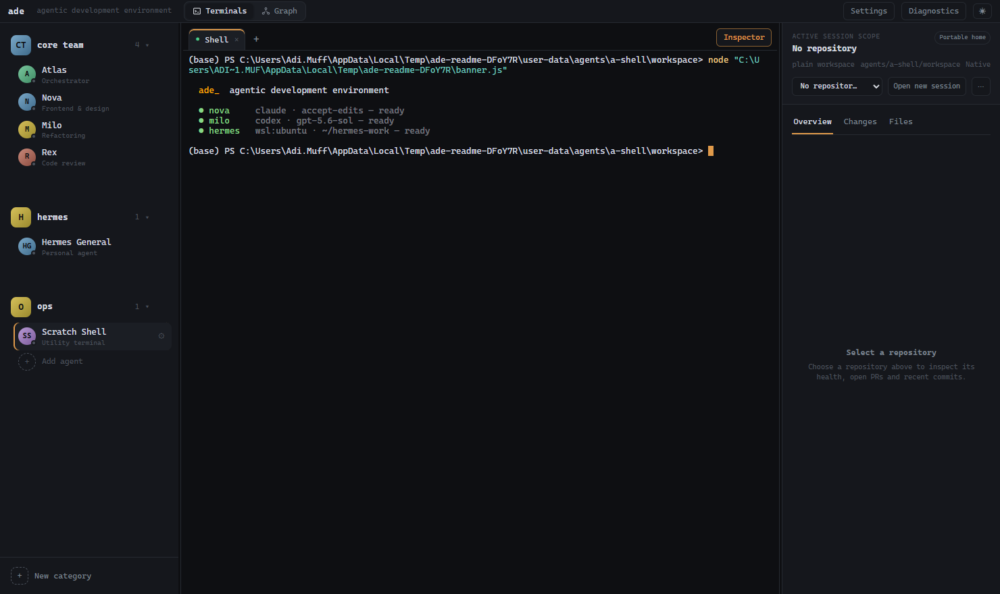
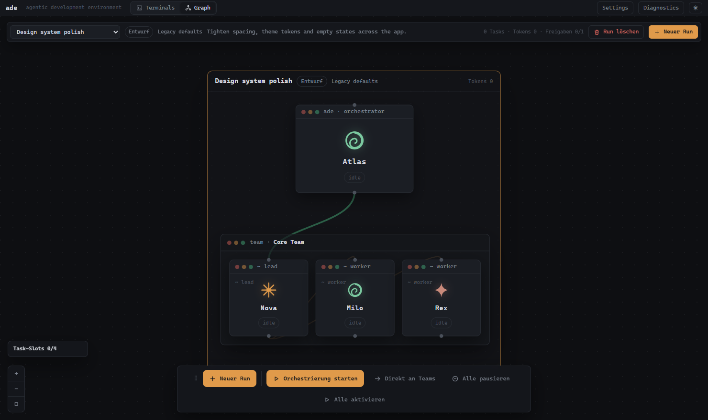
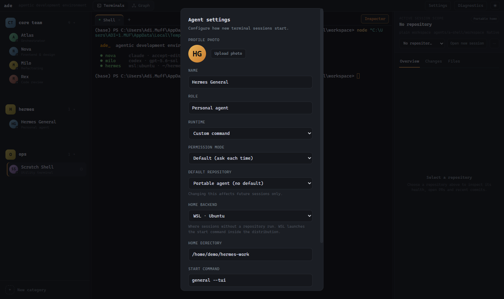

<p align="center">
  
</p>

<p align="center">
  
  
  
  
</p>

**ADE** (agentic development environment) is a desktop workspace where your CLI
coding agents — Claude Code, Codex, Gemini, OpenCode, Ollama models or any
custom CLI — live as **named identities with real terminals**. Give each agent
a face, a runtime, a permission mode and a home (native Windows or inside a
WSL distribution), then work with them interactively or orchestrate them as
managed runs on a graph.

---

## A tour

**Terminals** — categories and agents on the left, real PTY sessions as tabs,
repository scope and inspector on the right. Scrollback survives tab and agent
switches; sessions reconnect across reloads.

<p align="center">
  
</p>

**Graph** — the same agents, orchestrated. A managed run wires an orchestrator
to teams of leads and workers, schedules bounded one-shot tasks, waits for your
integration approval and finishes with verification. It can then publish a
verified Draft PR — never a direct push to `main`.

<p align="center">
  
</p>

**Agents are configurable identities** — photo, role, runtime, permission
mode, default repository, and a home that can live inside a WSL distribution.
An agent whose CLI only exists in Linux starts there natively, in the right
directory, with the right PATH.

<p align="center">
  
</p>

## Highlights

**Terminals & identities**
- Two-level rail: categories and agents, each with an editable name and
  profile photo. Sessions are real terminals (ConPTY on Windows) that
  auto-launch the agent's CLI.
- Per-agent permission modes translate to the right CLI flags
  (`claude --permission-mode acceptEdits`,
  `codex --dangerously-bypass-approvals-and-sandbox`, …).
- First-class Codex profiles pin an exact model and reasoning effort per
  identity (default `gpt-5.6-sol`); managed runs preserve them in provenance.
- Reusable agent templates: save runtime, profile and a bounded memory seed,
  then spawn independent identities from it.
- Bounded per-agent memory (`MEMORY.md` + `USER.md`) and a durable role-aware
  `AGENTS.md` contract, injected without dirtying repository worktrees.

**Repositories & execution backends**
- First-class repository scopes: give a specialist a default repo, keep a
  generalist portable, or pick a repo per session/run. Every agent/repo pair
  gets its own ADE worktree under `.ade-worktrees`.
- Explicit execution backends: a repository — or an agent's repo-less home —
  runs natively on Windows or deliberately inside `wsl:<distribution>`. Paths,
  Git, worktrees, diagnostics, terminals and managed tasks stay on the chosen
  side, and the UI always labels WSL scopes.
- Read-only Repository Inspector: branch/dirty/sync health, recent commits,
  capped patches and open GitHub PRs — still useful offline.

**Orchestration & publishing**
- Managed runs ask the orchestrator for a worker-specific plan, schedule
  validated assignments inside the run budget, gate integration behind an
  explicit approval, cherry-pick worker commit ranges transactionally and end
  with independent verification.
- Verified Draft-PR publishing re-checks the attested HEAD, the unchanged
  remote base and GitHub access, then creates only a new `ade/**` branch plus
  a Draft Pull Request. ADE has no direct push or merge to `main`.

**Safety net**
- Sandboxed renderer, strict CSP, runtime-validated IPC, encrypted write-only
  API-key storage (OS `safeStorage`), read-only runtime diagnostics and
  fail-closed token/cost budgets.

## Quickstart

```bash
pnpm i
pnpm dev        # development
pnpm build      # build to out/
pnpm start      # run the built app
```

First session in a fresh agent workspace: your CLI may show its own one-time
trust/login prompt — answer it in the terminal like in any shell. Stored API
keys and CLI sign-ins are per execution backend; authenticate WSL runtimes
inside the distribution.

### Keyboard

| Action | Shortcut |
|---|---|
| New / close terminal session | `Ctrl+Shift+T` / `Ctrl+Shift+W` |
| Previous / next session | `Ctrl+PageUp` / `Ctrl+PageDown` |
| Select session 1–9 | `Alt+1` … `Alt+9` |
| Terminals / Graph view | `Ctrl+1` / `Ctrl+2` |

Tab lists also support arrow keys plus Home/End with visible focus.

## Windows + WSL

Install WSL2 and, inside the distribution, provide `/bin/bash`, Git, Python 3
and `gio` (Ubuntu: `sudo apt install git python3 libglib2.0-bin`), plus the
agent CLIs you want to run there.

- **Repositories**: in the scope panel choose the path entry, select the
  `WSL · <distribution>` backend and import a Linux path such as
  `/home/you/project`. Worktrees are created Linux-side; ADE never mixes
  Windows Git with Linux Git for one binding.
- **Agent homes**: in Agent settings set *Home backend* to the distribution
  and *Home directory* to an absolute Linux path. Repo-less sessions then
  start the agent's CLI inside WSL — ideal for CLIs that only exist in Linux.

## Packaging

```bash
# Windows
pnpm package:dir        # dist/win-unpacked/ADE.exe
pnpm package:win        # dist/ADE-<version>-x64-Setup.exe

# Linux (build from a native Linux checkout)
pnpm package:linux:dir  # dist/linux-unpacked/ade
pnpm package:linux      # AppImage + .deb
```

The NSIS installer is unsigned for local builds; the release workflow signs
with `WIN_CSC_LINK`/`WIN_CSC_KEY_PASSWORD` when configured. The Linux profile
lives at `${XDG_CONFIG_HOME:-$HOME/.config}/ADE/ade/config.json`; release
evidence including the hosted 47-check packaged workflow is linked from
[GitHub Actions](https://github.com/McMuff86/ade/actions).

## Testing

```bash
pnpm verify           # typecheck + all focused suites + build + Electron E2E
pnpm test             # focused suites only
pnpm test:electron    # build + real Electron/ConPTY workflow (isolated profile)
pnpm test:wsl-backend # real WSL distro/Git/PTY integration (Windows + WSL)
```

Setting `ADE_WSL_BACKEND_E2E=1` on the Electron workflow adds the complete
cross-boundary scenario: WSL repository import, a WSL agent home, a managed
run executing inside the distribution, restart and cleanup.
`pnpm exec tsx scripts/readme-media.ts` regenerates the README screenshots
from a fictional demo profile.

Automated source/package workflows use disposable synthetic repositories so
CI stays deterministic. Operator-driven general-use and managed-run validation
uses RhinoClaw as the preferred real repository, always through disposable ADE
worktrees/branches; its working tree, `main`, deployed skill and live Rhino
installation remain untouched unless an operator separately authorizes them.

## Documentation

| Topic | Where |
|---|---|
| Product spec | `docs/SPEC.md` |
| Architecture | `docs/ARCHITECTURE.md` |
| Repository scopes | `docs/REPOSITORY_SCOPES_PLAN.md` |
| Verified publishing contract | `docs/VERIFIED_PUBLISHING_PLAN.md` |
| Repository inspector | `docs/REPOSITORY_INSPECTOR_PLAN.md` |
| Multi-platform boundaries | `docs/MULTIPLATFORM_PLAN.md` |
| Remote control plan | `docs/REMOTE_CONTROL_PLAN.md` |
| Reference analyses | `docs/reports/` |

## Notes

- Managed runs require exactly one orchestrator, at least one lead/worker,
  clean exclusive workspaces, a concrete goal and at least one approval in
  their budget. Repo-backed participants must be worktrees of one repository.
- The publishing gate protects ADE's own path; it is not an OS sandbox. An
  agent deliberately launched in bypass mode is a fully trusted process — use
  a separate credential boundary for agents that are not.
- `pnpm agents:codex` audits the saved roster; `-- --apply` migrates coding
  identities to native Codex profiles with durable `AGENTS.md` contracts.
- node-pty 1.1.0 ships Windows/macOS prebuilds; Linux/WSL needs a
  platform-native install (never reuse the Windows `node_modules` via
  `/mnt/c`). PTY smoke test: `ADE_PTY_SMOKE=1`.
- Token and monetary limits are fail-closed and only active when every
  selected runtime adapter reports the telemetry; unknown cost stays unknown
  instead of being treated as zero.
