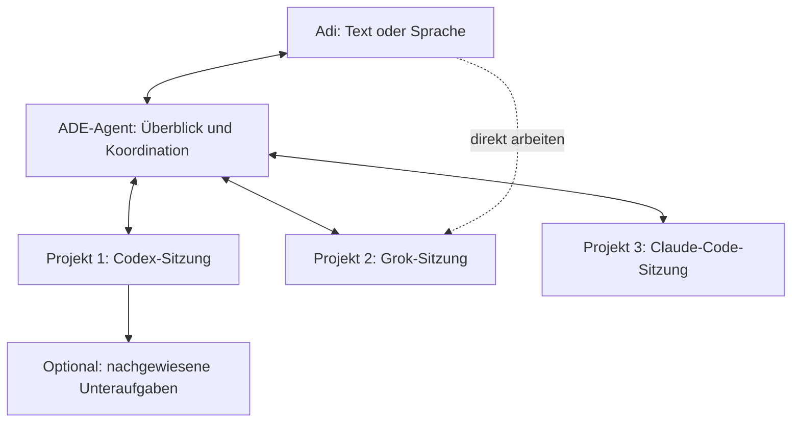

# Zentraler ADE-Agent: Projekte, Sitzungen, Graph und Sprache

Stand: 17. September 2026. **Implementierung beauftragt und begonnen.**
27.3 Sitzungswechsler und 26.6 native Codex-Fortsetzung sind fokussiert geprüft;
26.2 dauerhafte Zuordnung, Graph und explizite Übergaben/Morgenüberblick sind
auf PC/Tablet fokussiert geprüft. Claude-Fortsetzung ist nativ prototypisch
belegt, aber noch nicht als ADE-Gesprächsadapter angebunden. Der Gesamtabschluss
bleibt offen. [Aktueller Umsetzungs- und Prüfstand](MAIN_AGENT_IMPLEMENTATION.md).
33.2 hat einen ersten Textdialog auf PC/Tablet mit eigenem Verlauf und lesenden
Projektwerkzeugen und terminalunabhängigem Diktat; Sprachausgabe, Aktivierung und
autonome Projektsteuerung sind weiterhin offen.
[Aktueller Code- und Prüfstand](MAIN_AGENT_BASELINE.md).

Dieser Plan konkretisiert **26.2–26.4**, ergänzt **26.6–26.8** und **27.3** und
verbindet sie mit **33.1–33.3**. Bestehende Nummern behalten ihre Bedeutung.
26.1 (Anweisungskontext) bleibt eine Grundlage, 26.5 (zweiter Host) bleibt ein
separater Ausbau. Der gemischte CLI-Pilot gehört nicht zu den Codex-only-Messungen
von Goal 6.

## Verbindliches Benutzerbild

Am Morgen fragt Adi nach dem Stand von drei Projekten. ADE nennt belegte letzte
Arbeit, offene Punkte, ausdrücklich vorgemerkte nächste Schritte und einen als
Vorschlag erkennbaren Tagesplan. Danach:

- Projekt 1: eigene Codex-Sitzung führt eine neue Umsetzung aus.
- Projekt 2: eigene Grok-Sitzung führt ein Brainstorming; Entscheidungen werden
  festgehalten. Das Gespräch erzeugt keinen impliziten Implementierungsauftrag.
- Projekt 3: eigene Claude-Code-Sitzung setzt eine zugeordnete Aufgabe fort.
- Projekt 1 und 3 können gleichzeitig arbeiten. ADE vermittelt Rückfragen und
  Ergebnisse, während Adi mit Grok spricht.
- Adi kann jederzeit direkt im ausgewählten Projekt arbeiten. ADE-Betreuung
  ist pro Projekt optional; das Schliessen ihres Panels beendet keine Arbeit.
- „Merke dir das für die nächste Session“ erzeugt eine sichtbare, dauerhafte
  Übergabe mit Projekt-/Aufgabenbezug und kurzem bestätigtem Inhalt.
- Der globale Einstieg funktioniert mit Text und Sprache ohne zuvor geöffnetes
  Repository oder CLI-Terminal, auf Desktop und gekoppeltem Tablet.

Die drei Projekte behalten eigene Repositories, Workspaces, Sitzungen und
Kontexte. Der ADE-Agent liegt über getrennten Runs und Gesprächen. Ein heutiger
managed Run wird nicht zu einem Git-Verbund mehrerer Repositories erweitert.

## Reihenfolge und Startaufträge

Die Zeilen sind einzeln startbare Goals. „Vorbereitet“ bedeutet, dass Auftrag
und Abnahme beschrieben sind, nicht dass die Funktion implementiert ist.

| Reihenfolge | Goal / Startauftrag | Abhängigkeit | Stand |
|---|---|---|---|
| 1 | **26.6 – Sitzungstypen, Fähigkeiten und Verbindungsnachweise**: vollständige Matrix für interaktive Sitzung, Einzelaufgabe und managed Run je CLI erstellen und fehlende Sitzungsanbindung prototypisch prüfen | Aktueller Audit | Native Codex-Fortsetzung/Werkzeug-Rückkanal und Claude-Fortsetzung geprüft; restliche Matrix offen |
| 2 | **27.3 – In ADE zwischen Projekten und Sitzungen wechseln**: vorhandene Navigation auf PC/Tablet vereinheitlichen und verlustfrei prüfen | 26.6 Identitätsregeln; unabhängig von einem Sprachmodell lieferbar | Implementiert, automatisierte Bedienabnahme bestanden; physisches Tablet offen |
| 3 | **26.2 – Zuständigkeit und Planung**: ADE-Betreuung dauerhaft an konkrete Projekte, Aufgaben und Sitzungen binden | 26.6; benötigter Profilkontext aus 26.1 | Dauerhafter Betreuungsplan implementiert/geprüft; zentrale Ausführung offen |
| 4 | **26.3 – Ein Host, mehrere Projekte** und **26.4 – Steuerung und Bericht**: zwei parallele Umsetzungen, drittes Gespräch, Rückfragen und Ergebnisse verbinden | 26.2, nachgewiesene Adapterwege | Bestehende Goals konkretisiert |
| 5 | **26.7 – Graph für projektübergreifende Betreuung**: Beziehungen und Zustände aus derselben Hostprojektion darstellen und bedienen | 26.2, 26.3/26.4 Ereignisse, 27.3 Navigation | Explizite Projekt-/Arbeitsbeziehungen implementiert/geprüft; native Unteragenten offen |
| 6 | **26.8 – Direkt arbeiten und Betreuung übergeben**: zwischen Benutzer und ADE wechseln; Betreuung beobachten, koordinieren oder beenden | 26.4, 27.3; für Graph-Einstieg 26.7 | Vorbereitet |
| 7 | **33.1 – Übergabe und Morgenüberblick**: projektbezogene Entscheidungen und Wiedereinstieg dauerhaft sichern | 26.2, 26.4 Ergebnisse, 26.8 direkte Arbeit | Explizite Übergaben, strukturierte Ansicht und erster globaler Modelldialog auf PC/Tablet geprüft; automatischer Pilot offen |
| 8 | **33.2 – Globaler Dialog mit Text und Sprache**: dieselben freigegebenen Aktionen ohne Terminalvoraussetzung erreichen | 27.3, 26.4, 26.8, 33.1 | Bestehendes Goal konkretisiert |
| 9 | Gemeinsame Drei-Projekte-Abnahme; **33.3** ergänzt danach natürliche Sprechunterbrechung und Gesprächsfortsetzung zwischen Geräten | Alle Kernziele | Offen |

Der erste technische Pilot verbindet bereits drei deterministische Sitzungen
über Text und prüft echte Rückmeldungen. Native CLI-/Modellproben folgen je
Adapter; Sprache wird an die geprüften Verbindungen angeschlossen. Für den
Gesamtabschluss ist auch die native Kombination Codex/Grok/Claude erforderlich.
Ein fehlender Adapter wird als Lücke ausgewiesen und durch keinen Ersatzanbieter
als erfolgreich abgenommen.

## Goal 26.6 – Fähigkeiten und Sitzungsidentität

- [x] Vorhandenen Code, Testwege und Grenzen in [Baseline](MAIN_AGENT_BASELINE.md)
  erfassen; insbesondere Desktop-/Tablet-Unterschiede und managed Leases.
- [ ] Je Codex, Claude und Grok getrennt belegen: Start im exakten Workspace,
  laufende Sitzung beobachten, abgeschlossene Antwort erkennen, Frage/Antwort,
  weiteren Gesprächsschritt senden, unterbrechen, dieselbe native Unterhaltung
  fortsetzen, tatsächliche Unteragenten erkennen. Für interaktiv, Einzelaufgabe
  und managed Run jeweils separat; `unbekannt` ist keine Unterstützung.
- [ ] Version, Modell, Berechtigungsmodus, Backend und Beleg der getesteten
  Verbindung aufnehmen. Gewünschte Modellpins nicht als beobachtete ausgeben.
- [ ] Persistente fachliche Arbeit von flüchtiger PTY und nativer Gesprächs-ID
  unterscheiden. Eine Sitzung kann viele Gesprächsschritte enthalten; jede
  neue Benutzeranweisung ist nicht automatisch ein neuer Run.
- [ ] Start, Wiederanbindung an einen laufenden Prozess, native Fortsetzung nach
  Prozessende und neuer Start aus einer Übergabe im Vertrag getrennt benennen.
- [ ] Anbindung über nachgewiesene Protokolle/Ereignisse herstellen. Eine freie
  interaktive CLI darf nicht durch unkontrolliertes Tippen in Terminalkoordinaten
  zum vermeintlich verlässlichen Agentenwerkzeug werden.

**Abnahme:** neue und bereits offene Sitzung; zwei gleichnamige Projekte;
Umbenennung; falscher Workspace/Branch; Prozessende; Protokoll ohne Frage- oder
Fortsetzungsfähigkeit; mehrfach zugestellte und verspätete Ereignisse. Nur das
zugeordnete Ziel erhält Eingabe. Nicht belegte Fähigkeiten bleiben sichtbar
nicht verfügbar. Native Fortsetzung ist erst nach einem tatsächlichen zweiten
Gesprächsschritt mit überprüfbarem Kontext bestanden.

## Goal 27.3 – Projektwechsel auf PC und Tablet

- [ ] Eine gemeinsame Zielbeschreibung für ADE-Übersicht, Graph, Work,
  Projekte und Terminals verwenden: Projekt, Workspace, Sitzung/Arbeit,
  tatsächliche CLI, bekannte Zustände. Namen sind Anzeige, IDs sind Zuordnung.
- [ ] Bestehende Desktop-Wege (`openCliSession`, `openProjectSession`) und
  mobile Wege (`ContinueWork`, `terminalTarget`, `ProjectOpenIntent`) gezielt
  wiederverwenden. Kein Prozessstart durch blossen Ansichtswechsel.
- [ ] Im Projekt direkt zwischen dessen offenen Sitzungen und dem ADE-Dialog
  wechseln; aus einer Sitzung ein anderes aktives Projekt erreichen. Für die
  drei Pilotprojekte höchstens zwei bewusste Touch-Aktionen vom sichtbaren
  Projekt zum Ziel, ohne Umweg über eine neue Sitzung oder erneute Profilauswahl.
- [ ] Jede Sitzung behält Text-/Diktatentwurf und richtige Zielbindung.
  Projektwechsel während Aufnahme, Transkription, Senden oder unklarer Antwort
  darf keine Eingabe umleiten, verlieren oder wiederholen. Der Aufnahmeschritt
  muss sichtbar beendet/abgebrochen werden oder am ursprünglichen Ziel bleiben.
- [ ] Rückkehr erhält Auswahl, sinnvolle Scrollposition und nachvollziehbaren
  Fokus; neue Hintergrundausgabe stiehlt weder Fokus noch aktive Projektauswahl.
- [ ] Gleiche Behandlung für ein einzelnes Projekt, mehrere Sitzungen desselben
  Projekts, profilfreie CLI, Originalordner, Worktree und Agent-Home.
- [ ] Touchflächen mindestens 44 CSS-Pixel; Hoch-/Querformat, Bildschirmtastatur,
  leer/laden/Fehler/offline, Escape, Enter/Space, Fokus-Rückgabe und Fallback
  testen. Ein sichtbarer Projekt-/Sitzungstitel bleibt im Tastaturmodus erhalten.

**Abnahme:** A → B → C → A zehnmal über UI wechseln; gleiche Sitzungs-IDs und
unveränderte Prozessanzahl; pro Ziel eigener Entwurf; kein an ein falsches Ziel
zugestellter Marker. Reload, Verbindungsabbruch und Desktop-Eingaberücknahme
einbeziehen. Browserautomation bei 1280×800, 800×1280 und 390×844; zusätzlich
physisches Samsung-Tablet mit dokumentiertem Modell, Browser und Netz testen.
Viewport-Simulation allein beweist keine physische Tastatur-/Mikrofonbedienung.

## Goal 26.2 – Persistente Betreuung und Projektzuständigkeit

- [ ] Übergeordneten Betreuungszustand mit stabiler ID, ADE-Profil,
  ausgewählten Projekten, beauftragten Zielen und verknüpften Arbeiten speichern.
  Ein gleiches Agent-Profil in zwei Projekten erzeugt zwei getrennte Kontexte.
- [ ] Verbindungen zu interaktiven Gesprächen und getrennten Kind-Runs
  modellieren; ein Gespräch wird nicht als künstlicher Coding-Run angelegt.
- [ ] Pro Projekt Modus **Direkt**, **Beobachten** oder **Koordinieren** mit
  Geltungsbereich und Änderungsrevision festhalten. „Brainstormen“ erhält einen
  Gesprächsauftrag und keine Freigabe für Implementierung.
- [ ] Konkrete Übernahme einer vorhandenen Sitzung anbieten. Main löst und
  validiert Zielidentität und Verfügbarkeit; bei mehreren passenden Sitzungen
  ist eine Auswahl erforderlich. Ein offenes Terminal allein erteilt keinen Auftrag.
- [ ] Der zentrale ADE-Agent erhält Werkzeuge für zulässige ADE-Aktionen und
  benötigte Ergebnisabfragen. Sein Modell/Profil wird bewusst konfiguriert und
  separat geprüft; keine verdeckte Bindung an die CLI von Projekt 1.

**Abnahme:** drei getrennte Projekte, mehrfach genutztes Profil, Projekt ohne
CLI, gelöschtes/umbenanntes Projekt, entzogenes Tablet-Recht, doppelte Namen,
veraltete Auswahl und Scopewechsel während Launch. Planung startet keine Arbeit;
ein bereits erteilter, unveränderter Auftrag braucht keine erneute Alltagsfreigabe.

## Goals 26.3 und 26.4 – Parallele Arbeit und Rückkanal

- [ ] Projekt 1 und 3 gleichzeitig in getrennten Arbeitsbereichen ausführen;
  Projekt 2 führt sein eigenes Grok-Gespräch. Sichere Fortsetzung bestehender
  Arbeit nach dem in 26.6 tatsächlich belegten Verfahren anbieten.
- [ ] Für Coding-Arbeit bewusst zwischen interaktivem Gespräch, Einzelaufgabe
  und managed Integrationslauf unterscheiden. Der heutige `runTask:submit`-Weg
  allein beweist weder Langzeitdialog noch managed Integration.
- [ ] ADE nimmt normalisierte Status-/Ergebnisereignisse entgegen. Eindeutige
  Ereignis- und Korrelations-IDs verbinden Auftrag, Empfang, Frage, Antwort und
  Ergebnis; Modelltexte erzeugen keine autoritativen Zustandsübergänge.
- [ ] Rückfrage aus Projekt 3 im zentralen Dialog beantworten und genau an
  diese Frage zustellen; die Antwort gilt erst nach Laufzeitbestätigung als
  zugestellt. Unklare Zustellung bleibt prüfbar, ohne automatisches Wiederholen.
- [ ] Fehler in einem unabhängigen Projekt lassen andere Arbeit weiterlaufen;
  abhängige Arbeit wartet. „Betreuung beenden“, „Projektaufgabe stoppen“ und
  „alle beauftragten Arbeiten stoppen“ haben verschiedene, sichtbare Wirkungen.
- [ ] Koordination ist ereignisgesteuert: relevante Übergänge wecken den
  ADE-Agenten, Hintergrundausgabe allein startet nicht dauernd Modellanfragen.
  Rückfragen melden, Routinefortschritt bündeln; Gespräch nicht ständig unterbrechen.
- [ ] Globale Task-Slots und Limits berücksichtigen. Die bestehende Vier-Slot-
  Grenze gilt für Task-Sessions; interaktive Prozesse und interne native
  Sub-Agenten nicht als dadurch vollständig begrenzt ausgeben. Budget/Slotbedarf
  des ADE-Agenten und abhängiger Aufgaben gesondert testen, kein Wartedeadlock.

**Abnahme:** zwei unabhängige Schreibaufträge mit eindeutig unterschiedlichen
Ergebnissen in zwei Repositories; fortlaufendes drittes Gespräch; Frage/Antwort
und Ergebnis erreichen den richtigen Empfänger. Negative Fälle: Doppelstart,
vertauschte Antwort, verspätetes Ergebnis nach Abbruch, Kindfehler, Slotmangel,
Host-Neustart und Netztrennung. Kein Git-Zustand wird projektübergreifend
integriert. Bestehende managed Lease-, Commit-, Verifikations- und
Publikationsregeln gelten unverändert.

## Goal 26.7 – Beziehungen im Graph

- [ ] Host liefert eine begrenzte gemeinsame Sicht auf ADE-Betreuung → Projekt
  → konkrete Sitzung/Run → belegte Unteraufgabe. Desktop und Tablet verwenden
  dieselben Identitäten, Beziehungsarten und Zustände.
- [ ] Runtime-/Profildarstellung aus stabiler Zuordnung und gespeichertem
  Laufzeitstand ableiten. Den heutigen mobilen Namensvergleich ablösen;
  gleiche Agentennamen oder spätere Profiländerungen ändern keine Historie.
- [ ] Beziehungen unterscheiden: **betreut**, **führt aus**, **wartet auf
  Ergebnis** und **delegierte Unteraufgabe**. Zuständigkeit bedeutet keine
  Ausführungsabhängigkeit; nur Abhängigkeiten bestimmen die Startreihenfolge.
- [ ] Bestehende Run-Graphen bleiben aufklappbare Details; auch direkte Arbeit
  ohne ADE-Betreuung und ein einziges Projekt erhalten eine brauchbare Ansicht.
- [ ] Knoten öffnet genau die verknüpfte Sitzung, Frage oder das vollständige
  Ergebnis; Rückweg erhält Auswahl. Steueraktionen adressieren den fachlichen
  Datensatz und werden in Main validiert, nicht durch die Position einer Linie.
- [ ] Angeforderte und bestätigte Pause/Abbruch/Antwort sowie unbekannter oder
  veralteter Zustand unterscheiden. Bereits vorhandenes historisches Ergebnis
  bleibt von neuer Arbeit desselben Agenten unterscheidbar.
- [ ] ADE-Unteraufgaben besitzen geprüfte Elternzuordnung und begrenzte Tiefe.
  Interne native Sub-Agenten nur bei belegter Laufzeitmeldung darstellen;
  andernfalls „Unteraufgaben nicht einzeln sichtbar“, ohne erfundene Knoten.
- [ ] Auf Tablet zusätzlich eine kompakte Projekt-/Agentliste als gleichwertigen
  Einstieg anbieten; wichtige Aktionen benötigen weder präzises Zoomen noch
  Hover. Tastaturwahl mit Enter/Space, Escape und Fokus-Rückgabe prüfen.

**Abnahme:** drei Projekte gleichzeitig, zwei laufend/eines im Gespräch;
Knotenwahl passt zu Workspace und Sitzung; Ereignisse nach Umsortieren treffen
weiterhin denselben Knoten. Doppelte Namen, verwaiste Referenz, verbotene
Abhängigkeitszyklen, fehlende Unteragenten-Telemetrie, Teilfehler und Reload
prüfen. Projektfilter darf verborgene Arbeit weder stoppen noch umhängen.

## Goal 26.8 – Direkte Arbeit und Übergabe

- [ ] Anzeige/Fokus, Terminal-Eingabebesitz und ADE-Koordinationsauftrag separat
  führen. Das Öffnen eines Knotens übernimmt keine Eingabe und ändert kein Ziel.
- [ ] Übergabe Benutzer ↔ ADE pro Sitzung atomar mit Revision/Bestätigung
  durchführen. Alte, noch ausstehende Befehle nach Besitzerwechsel ablehnen;
  Rückfragen dürfen nicht von zwei Oberflächen doppelt beantwortet werden.
- [ ] Bestehende managed Leases nicht zur direkten Übernahme umgehen. Je
  nach nachgewiesener Laufzeit den bestehenden Gesprächskanal verwenden oder
  Arbeit geordnet anhalten, Ergebnis/Übergabe sichern und erst danach einen
  erlaubten interaktiven Schritt beginnen. Kein zweiter Schreiber im Lease.
- [ ] Direkte Entscheidungen aus dem Projektgespräch in eine nachvollziehbare
  Zusammenfassung überführen. Fehlt dafür zuverlässige Beobachtung, Änderung
  explizit übernehmen lassen und ADEs Kenntnisstand als unvollständig zeigen.
- [ ] ADE-Panel schliessen erhält Betreuung und Prozesse; „nur direkt arbeiten“
  entfernt den Koordinationsauftrag, ohne die Projektsitzung zu beenden.

**Abnahme:** Benutzer übernimmt während eines ADE-Schritts; Tablet verliert
Eingabe an Desktop; Sitzung endet während Übergabe; altes Kommando verspätet;
ADE-Panel geschlossen; Rückkehr aus Graph. Alle Varianten mit einem Projekt
und parallel mit drei Projekten prüfen. Nach Rückgabe arbeitet ADE mit dem
aktualisierten Ziel und gibt keine überholte Anweisung erneut aus.

## Goal 33.1 – Erinnerung und Morgenüberblick

- [ ] Übergabe pro Projekt/Arbeit speichern: Entscheidungen, offene Punkte,
  nächster Schritt, Quelle, Zeit und Revision. Benutzer merkt ausdrücklich vor;
  ADE zeigt kurz, was gespeichert wurde, und ermöglicht Korrektur/Löschen.
- [ ] Arbeitsrückblick aus nachgewiesenen Ergebnissen und Übergaben erzeugen.
  Laufender Prozess, Exit 0 und „keine Ausgabe“ sind keine Erfolgsnachweise.
- [ ] Morgens drei Projekte gemeinsam zusammenfassen, dann konkreten Vorschlag
  aus Prioritäten/offenen Punkten machen. Fakten, Vormerkung und Vorschlag
  unterscheidbar halten; bei fehlenden Quellen die Lücke benennen.
- [ ] Über ADE-Neustart verfügbar; kein dauerhaft laufender Modellprozess nötig.
  Aufbewahrung, Quellenverlust und Berechtigungswiderruf ausdrücklich behandeln.

**Abnahme:** Abendübergabe speichern, ADE regulär schliessen, neu starten,
Morgenüberblick abrufen. Eine erledigte, eine offene und eine fehlgeschlagene
Arbeit, korrigierte Vormerkung, leere/veraltete Historie und eingeschränkter
Tablet-Projektzugriff. Volltextdetails bleiben auffindbar; keine erfundenen
Erfolge oder Übertragung privater Projektinhalte in ein anderes Projekt.

## Goal 33.2 – Globaler Dialog und Sprache

- [ ] Zentralen Textdialog und dieselben Aktionen per Sprache aus allen
  Hauptansichten erreichen; noch keine CLI und kein Projekt ausgewählt.
- [ ] Sitzungsunabhängigen Aufnahme-/Dialogvertrag ergänzen. Bestehende
  terminalgebundene Diktattickets nicht mit einer erfundenen Sitzung umgehen.
- [ ] Gemeinsamen Kontext für Text/Sprache, sichtbares Ziel und zuletzt
  verstandenen Auftrag verwenden; Projekt 2 bleibt im Brainstorming, bis ein
  Umsetzungsauftrag erteilt wird. Mehrdeutige Projektnamen klären.
- [ ] Hör-/Sprech-/Verarbeitungszustand, Textalternative, Stoppen und
  verständliche Wiederaufnahme bereitstellen. Kurze gesprochene Meldung führt
  zu vollständigen prüfbaren Details; keine automatische Terminaltextdeutung
  als letzte Modellantwort.
- [ ] Mikrofon/Wiedergabe bleiben am aktiven Gerät. Berechtigungswiderruf und
  Verbindungsabbruch beenden laufende Aufnahme/Übertragung. Gerätewechsel
  erhält Host-Kontext, ohne ausstehende Befehle oder Audio zu wiederholen.

**Abnahme:** „Wo stehen wir?“ → „Projekt 1 umsetzen“ → „Mit Grok in Projekt 2
brainstormen“ → Rückfrage aus Projekt 3 beantworten → „Merke dir das für morgen“.
Mit Text und mit Stimme, auf PC und Tablet, ohne vorbereitete Terminals.
Die erste Version nutzt bewusste Aktivierung; natürliches Unterbrechen per
Stimme/Wakeword bleibt gesonderte Abnahme in **33.3**.

## Gemeinsame technische Verträge

- Hostseitige Dienste besitzen Beziehungen, Berechtigungen und Zustände.
  Mobile Adapter rufen nur `AdeApplicationService`; neue DTOs nach `shared`,
  IPC-Klassifikation und Wire-Whitelist je neuer Operation. Keine generische
  Freigabe für Shell, PTY, Dateisystem oder Hostkonfiguration.
- Schreibaktionen haben Prinzipal, Scope, Zielrevision, gebundene Idempotenz
  und Audit. Reconnect liest erst den Stand; unbekannte Zustellung löst keinen
  automatischen neuen Auftrag aus. Bestehende Freigabe gilt im erteilten Scope.
- Prompts, Rohprotokolle, Mailboxtexte und verborgene Reasoning-Inhalte gehen
  nicht in globale Rendereransichten. Zulässige vollständige Ergebnisdetails
  folgen `RunReport`/`ResultDetails`; Wire zusätzlich redigieren, keine Hostpfade.
- Neue Journaltypen werden im Archivvertrag und `applyRetention` mitgeführt.
  Für Beziehungen über mehrere Runs Archivzuordnung und Löschreihenfolge vor
  Implementierung festlegen: keine verwaisten Referenzen, aktive/geleaste/
  publizierte Arbeit nicht prunen. Dauerhafte Übergaben benötigen eine eigene
  begrenzte Aufbewahrung mit Quellenrevision; sie dürfen nicht zufällig mit
  dem flüchtigen Terminalpuffer verschwinden.
- Rollen und Übergaben ausserhalb geleaster Repositories speichern. Modell-
  und Dokumentinhalte erweitern keine Rechte; Anweisungsquellen und Herkunft
  bleiben nachvollziehbar. Ein Unteragent erbt keine globale ADE-Zuständigkeit.

## Durchgängiger Pilot und Testlieferung

| Fall | Ablauf | Verbindlicher Nachweis |
|---|---|---|
| P1 | Drei frische Testrepositories, Codex-/Grok-/Claude-Zuordnung, globaler Einstieg | Richtige Workspace-/Sitzungsidentität; kein versteckter Ersatzanbieter |
| P2 | Projekt 1 und 3 arbeiten, Projekt 2 brainstormt | Zeitlich überlappende Arbeit; zwei verschiedene überprüfte Dateiergebnisse; Gespräch ohne Implementierungsstart |
| P3 | ADE erhält Frage aus Projekt 3; Adi antwortet aus Projekt 2 | Frage-/Antwort-ID stimmt; native Empfangsbestätigung; kein Text in Projekt 1/2 zugestellt |
| P4 | Zehn Wechsel A → B → C → A, Graph → Sitzung → ADE | Keine Doppelprozesse, kein Entwurfsverlust, stabile Ziel-/Fokuszuordnung, Touchweg gemessen |
| P5 | Direkte Übernahme, anschliessend Betreuung zurückgeben | Ein Eingabebesitzer; neue Entscheidung übernommen; keine Verletzung managed Leases |
| P6 | Stop, Teilfehler, Verbindungsabbruch, verlorene Antwort und Host-Neustart | Unabhängige Arbeit erhalten; unbekannte Zustellung wahr; kein automatischer Doppelstart |
| P7 | Abendvormerkung und Morgen nach regulärem Neustart | Gespeicherte Übergabe und Quellen abrufbar; passender Vorschlag; dieselbe oder ausdrücklich neue Sitzung |
| P8 | Derselbe Ablauf per Sprache auf physischem Tablet | Keine Terminalvoraussetzung; richtiges Ziel; Stop/Unterbrechung, Audio und Tastatur praktisch bedienbar |

Neue Driver sind **geplant und noch nicht vorhanden**:

- `scripts/test-main-agent-contracts.ts`: Identitäten, Beziehungen, Fähigkeiten,
  Revisionen, Ereignisse, Rechte, Archiv/Retention und negative Kontrollen.
- `scripts/test-main-agent-electron.ts`: P1–P7 mit isoliertem ADE-Profil,
  echten Electron-/Browseroberflächen und deterministischen CLI-Prozessen;
  gleicher Datenvertrag für Graph und kompakte Tablet-Liste.
- `scripts/test-main-agent-native.ts`: P1–P3/P5/P7 mit tatsächlichen Versionen
  von Codex, Grok und Claude; Zweitturn/Frage/Fortsetzung einzeln belegen.
- Erweiterungen der bestehenden Sprachdriver für P8; reale Mikrofon-/Provider-
  und Samsung-Abnahme gesondert dokumentieren.

Jede Umsetzung liefert zunächst fokussierte positive und negative Tests.
Negative Kontrollen zählen nur beim beabsichtigten Fehler und anschliessendem
positiven Kontrolllauf. Vor Gesamtfertigmeldung `pnpm verify` über den finalen
Quellstand vollständig ausführen, danach den nativen Drei-Projekte-Pilot und
physischen Tablet-Durchlauf belegen. Testfixture, reales CLI-Modell und reale
Hardware sind getrennte Nachweisklassen.

Erste Zielplattform: **native Windows-ADE plus gekoppeltes Tablet im Browser**.
Windows-UI mit WSL-Backend, native Linux/WSLg und macOS erhalten eigene Zeilen
mit konkreten Ergebnissen. Multi-Host ist weiterhin Goal 26.5/28–30. Unbegrenzte
rekursive Delegation und Hintergrund-Wakeword sind kein stiller Teil des Piloten.

Nächster Startauftrag: **Goal 26.6 abschliessen und Goal 27.3 aus dem geprüften
Bestand umsetzen.** Die in der Baseline dokumentierten Testlücken zuerst
auflösen; danach die drei Laufzeitverbindungen einzeln und gemeinsam prüfen.
