# ADE User-Guide

Stand: 9. September 2026 · Einstieg mit Windows-PC und Samsung-Tablet/Chrome.

ADE bündelt deine Projekte, CLI-Assistenten und Aufgaben. Programme und Dateien
liegen auf dem PC. Das Tablet bedient ADE über eine private Verbindung; es muss
die Entwicklungswerkzeuge nicht selbst installieren.

**Der neue Projekteinstieg: Projekte → Workspace öffnen.** Die Liste zeigt auch
Ordner unter deinem Projekt-Stamm, die noch nicht in ADE erfasst sind. Der geöffnete
Workspace zeigt seinen tatsächlichen Branch und benötigt kein Agent-Profil.
Branch-Auswahl und CLI-Start in diesem unabhängigen Workspace folgen im aktiven
[Goal T3](PROJECT_WORKFLOW_GOALS.md). Bis dahin führt **Agent-Arbeitskopie →
Agent-Arbeitskopie öffnen** zum bisherigen CLI-Ablauf in den folgenden Bildern.
Für eine neue Idee verwendest du **Neues Projekt**. Für Hermes General oder
Sentinel ohne Projekt verwendest du **Overview → Terminal öffnen** beim Agenten.

Die Bilder zeigen echte ADE-Oberflächen mit Beispieldaten aus einer isolierten
Windows-/Chromium-Instanz. Terminalprogramme sind lokale Demos, keine echten
Modellantworten. Bild 10 simuliert den verfügbaren Platz über einer Bildschirmtastatur;
es ist keine Aufnahme einer Samsung-Tastatur. Pairing-Daten und der temporäre
Projektpfad sind maskiert. [Aufnahmeprotokoll](media/user-guide/capture.json).

Für die neue Ordnerübersicht am Tablet am PC unter **Settings → Verbundene Geräte**
die Rechte **Workspace-Dateien und Git-Diffs lesen** und **Projekt-Workspaces ohne
Agent-Profil öffnen** freigeben. Danach **Projektordner aktualisieren** verwenden.
Normale Ordner ohne Git werden angezeigt; Git wird darin nicht automatisch angelegt.
Bei einer verlorenen Antwort **Workspace-Öffnung prüfen** wählen. ADE verwendet
dieselbe Aktion erneut, auch nach einem Neuladen der Seite.

Die bisherigen Bilder zeigen überwiegend den Agent-Ablauf. Die Gesamtaufnahme
wird mit Abschluss der Branch-/Git-Oberfläche im Goal T6 erneuert.

## Inhalt

- [1. Den richtigen Einstieg wählen](#1-den-richtigen-einstieg-wählen)
- [2. ADE einmal am PC einrichten](#2-ade-einmal-am-pc-einrichten)
- [3. Das Tablet verbinden](#3-das-tablet-verbinden)
- [4. Ein neues Projekt beginnen](#4-ein-neues-projekt-beginnen)
- [5. In einem bestehenden Projekt arbeiten](#5-in-einem-bestehenden-projekt-arbeiten)
- [6. Terminal und Tastatur bedienen](#6-terminal-und-tastatur-bedienen)
- [7. Hermes und OpenClaw ohne Projekt](#7-hermes-und-openclaw-ohne-projekt)
- [8. Dateien behalten und Änderungen sichern](#8-dateien-behalten-und-änderungen-sichern)
- [9. Aufgaben und Runs](#9-aufgaben-und-runs)
- [10. Pausieren, weiterarbeiten und aktualisieren](#10-pausieren-weiterarbeiten-und-aktualisieren)
- [11. Wenn etwas nicht funktioniert](#11-wenn-etwas-nicht-funktioniert)

## 1. Den richtigen Einstieg wählen

| Dein Vorhaben | Dein Weg in ADE Mobile |
|---|---|
| Bestehenden Code bearbeiten | **Projekte → Projekt → Workspace öffnen → Arbeiten mit** |
| Eine neue Idee ausprobieren | **Neues Projekt → Name → Mit Codex starten** |
| Mit einem persönlichen Assistenten sprechen | **Overview → Terminal öffnen** beim Agenten |
| Hermes-/OpenClaw-Weboberfläche verwenden | **Web-Dashboard** beim entsprechend eingerichteten Agenten |
| Eine abgegrenzte Arbeit delegieren | **Work → Neue Aufgabe** |
| Mehrere Agents koordiniert arbeiten lassen | **Work → Neuer Run**, danach Fortschritt in **Work/Graph** |

Ein **Projekt** ist ein registriertes Git-Repository. Ein **Agent** ist ein
gespeichertes Profil mit Name, Startprogramm, Einstellungen und eigenem Ordner.
Ein **Workspace** ist das konkrete Arbeitsverzeichnis. Eine **Sitzung** ist ein
laufendes Terminalprogramm. Ein **Run** ist ein von ADE verwalteter Aufgabenablauf.

Du brauchst keinen Run, um interaktiv mit Codex, Claude oder Grok zu arbeiten.

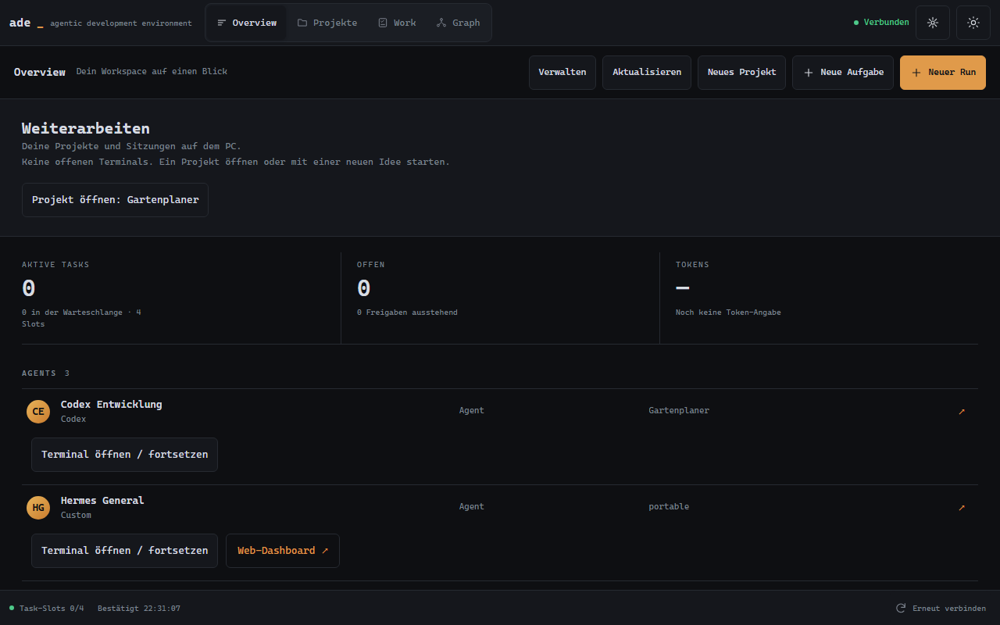

*Overview ist der gemeinsame Überblick. Für die tägliche Arbeit an Code führt der
Reiter Projekte direkt zum gewünschten Arbeitsbereich.*

## 2. ADE einmal am PC einrichten

Für diesen Guide wird ADE auf nativem Windows gestartet. Windows mit einem
WSL-Backend, eine native Linux-/WSLg-App und macOS sind unterschiedliche
Installationsmodelle. Ihre Nachweise und Grenzen stehen in
[MULTIPLATFORM_PLAN.md](MULTIPLATFORM_PLAN.md); diese Anleitung verspricht keine
gleichwertige Einrichtung auf allen Plattformen.

Wenn ADE bereits läuft, beginne bei **Startprogramm und Anmeldung prüfen**.
Für einen Start aus dem Quellcode benötigst du Git, Node.js 22 und pnpm 9.15.9
(die im Repository verwendete Werkzeuglinie). Bei einem frischen Windows-Setup
können zusätzlich native Build-Werkzeuge für `node-pty` erforderlich sein;
bei Installationsfehlern zuerst dessen Build-Ausgabe prüfen.

```powershell
git clone https://github.com/McMuff86/ade.git
cd ade
pnpm install --frozen-lockfile
pnpm build
pnpm start
```

**Startprogramm und Anmeldung prüfen:** Installiere die gewünschte CLI nach deren
Herstelleranleitung auf dem PC und melde dich dort an. In ADE **Settings** öffnen
und beim jeweiligen Harness den Installations-/Anmeldestatus prüfen. Ein vorhandenes
Programm bedeutet noch nicht, dass dein Konto jedes Modell verwenden darf.
Windows und WSL haben getrennte Installationen, PATHs und Anmeldungen.

**Ein erstes Profil:** In **Terminals** eine **New category** anlegen, etwa
„Entwicklung“, und darin über **Add agent** einen Agenten erstellen. Name und
Runtime wählen, etwa „Codex Entwicklung“ und Codex. Für den Einstieg die normale
Berechtigungsstufe verwenden. Modell und Reasoning nach der tatsächlich geladenen
Auswahl wählen; bei Ladefehlern zuerst die Meldung prüfen. Die dynamische
Modellauswahl befindet sich derzeit am Desktop. Gespeicherte Einstellungen gelten
beim Start des gespeicherten Profils.

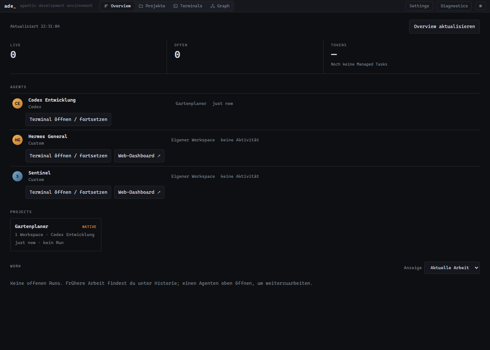

**Bestehendes Repository aufnehmen:** In **Terminals** einen Agenten wählen.
Im Repository-Bereich **⋯ → Add repo** öffnen und den bestehenden Git-Ordner
auswählen. **Pfad…** erlaubt die direkte Pfadeingabe und eine ausdrückliche
Backend-Wahl. Importieren registriert das Repository; es verschiebt den Ordner nicht.

**Speicherort für neue Projekte:** In **Settings → Neue Projekte vom Tablet**
den **Projekt-Stammordner** wählen. Für Adis PC ist
`C:\Users\Adi.Muff\repos` sinnvoll, allgemein `C:\Users\<Name>\repos`.
Optional ein **Codex-Startprofil** wählen und **Projektstart speichern** drücken.
Bestehende Projekte behalten ihren bisherigen Speicherort.

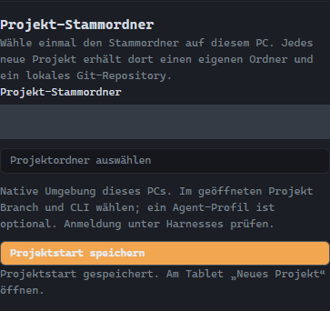

*Ein neues Projekt bekommt direkt einen eigenen Ordner unter diesem Stammordner.
Die zusätzliche ADE-Arbeitskopie erklären wir in Abschnitt 8.*

## 3. Das Tablet verbinden

1. Tailscale auf PC und Tablet verbinden. Beide Geräte müssen zum selben Tailnet
   gehören und sich erreichen dürfen. MagicDNS und HTTPS müssen verfügbar sein.
2. Am PC **Settings → Mobiler Zugriff → Mit Tailscale aktivieren** wählen.
3. **Tablet oder Smartphone koppeln** drücken. Den QR-Code mit dem Tablet scannen
   oder die angezeigte ADE-Adresse in Chrome öffnen und den Pairing-Code eingeben.
4. Einen Gerätenamen, etwa „Mein Samsung Tablet“, setzen und **Dieses Gerät verbinden** drücken.
5. Auf **Verbunden** warten. Der Code ist einmalig und fünf Minuten gültig.

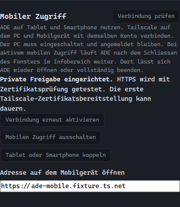

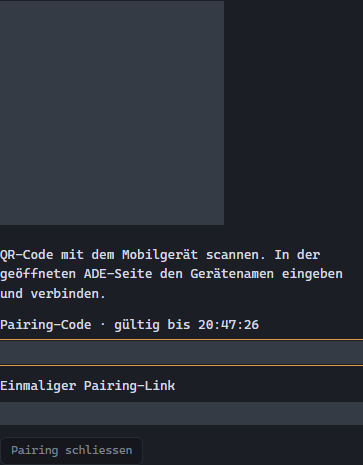

Der Gerätename ist ein Anzeigename in ADE; er ändert nicht die Tailscale-Adresse
des PCs. Eine erfolgreiche Kopplung und die Freigabe zusätzlicher Funktionen
sind getrennte Schritte.

Am PC **Settings → Verbundene Geräte → Geräte aktualisieren** wählen. Für den
vollständigen Projekteinstieg die folgenden Rechte setzen und
**Verwaltungsrechte speichern** drücken:

| Recht | Wann du es brauchst |
|---|---|
| Agents und Projekte erstellen | Neue Projekte oder eine neue Projekt-Arbeitskopie vorbereiten |
| Workspace-Dateien und Git-Diffs lesen | Projektworkspace, Dateien und Änderungen öffnen |
| Interaktive Terminals steuern | CLIs starten und darin schreiben |
| Kleine Workspace-Textdateien bearbeiten | Optional: vorhandene Textdateien direkt im ADE-Dateieditor ändern |

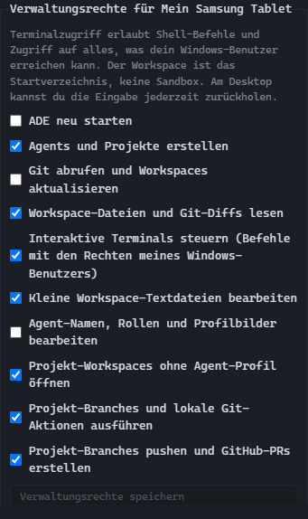

Terminalzugriff erlaubt Befehle mit den Rechten des PC-Benutzers. Der gewählte
Workspace ist das Startverzeichnis. Vergib diese Freigabe bewusst an dein eigenes
Gerät. Tailscale allein ersetzt diese ADE-Freigabe nicht.

Optional ADE über Chromes Installations-/Startbildschirmfunktion ablegen.
Eine separat gespeicherte Browser-/PWA-Installation kann eine eigene Kopplung
benötigen. Der PC muss eingeschaltet, angemeldet und erreichbar bleiben.

## 4. Ein neues Projekt beginnen

1. In ADE Mobile **Neues Projekt** drücken, beispielsweise auf **Projekte**.
2. Einen Namen eingeben, etwa „Mein Notizbuch“. Ohne Namen erzeugt ADE einen.
3. Das vorbereitete Codex-Profil oder ein neues Standardprofil wählen.
4. **Mit Codex starten** drücken. ADE legt ein lokales Git-Projekt an,
   bereitet dessen Arbeitskopie vor und öffnet Codex.

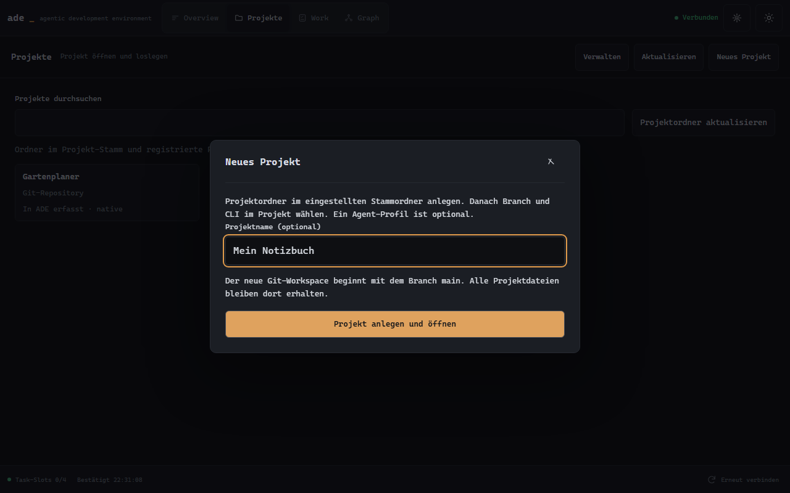

Der neue Projektablauf startet derzeit mit **Codex**. In einem geöffneten
Projektworkspace kannst du später **Claude CLI**, **Grok CLI** oder eine Shell
wählen. Es wird noch kein GitHub-Repository automatisch angelegt oder veröffentlicht.

Ein guter erster Auftrag wäre:

> Ich möchte eine kleine Notiz-App. Schlage zuerst ein einfaches Grundgerüst vor.
> Erstelle danach eine startbare erste Version und erkläre, wie ich sie teste.

Bei einer unterbrochenen Antwort **Start fortsetzen** verwenden. ADE prüft den
bereits begonnenen Vorgang; kein zweites Projekt nur wegen einer Warteanzeige anlegen.
**Startablauf schliessen · erstellte Arbeit behalten** beendet den Startablauf,
ohne bereits angelegte Projektdateien zu löschen.

## 5. In einem bestehenden Projekt arbeiten

1. **Projekte** öffnen und das gewünschte Projekt suchen.
2. Die Projektkarte und danach **Workspace öffnen** wählen.
3. Unter **Arbeiten mit** Codex, Claude CLI, Grok CLI oder die Shell auswählen.
4. Den zugehörigen **… öffnen**-Knopf drücken.

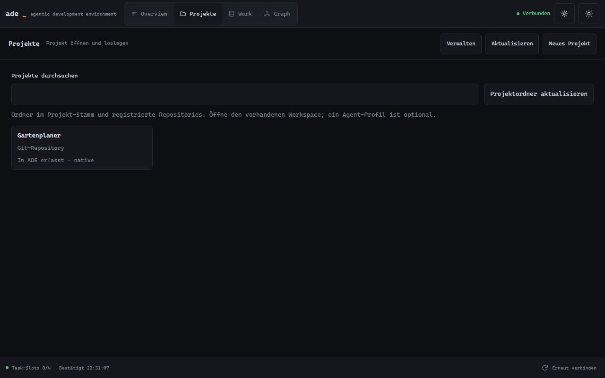

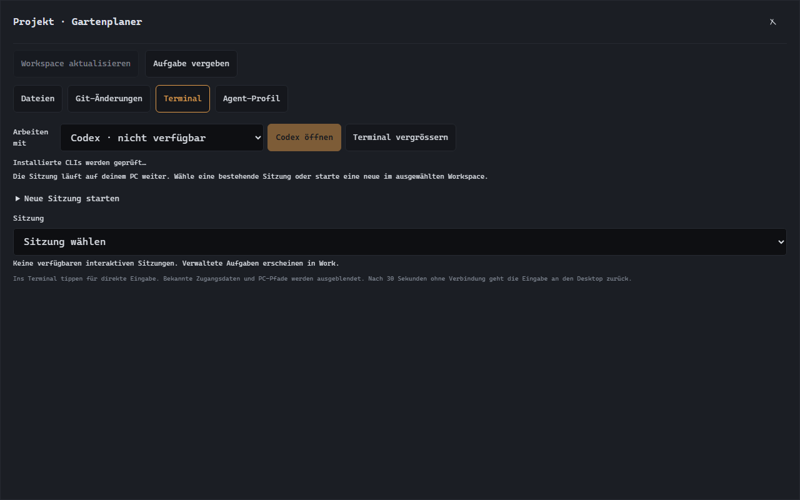

**Workspace öffnen** startet noch keine CLI. Das optionale Workspace-Profil ordnet
die Arbeitskopie zu; die CLI wählst du danach unabhängig davon. Fehlt die CLI,
am PC Installation und Anmeldung in der angezeigten Umgebung prüfen.

Existiert bereits eine passende laufende Sitzung, öffnet **… öffnen** diese wieder.
Ist deren CLI bereits beendet und nur das Terminal noch offen, startet **… öffnen**
eine neue CLI. Das alte Terminal bleibt zum Nachlesen oder für Shell-Befehle erhalten.
Eine weitere Sitzung wird über **Neue Sitzung starten** ausdrücklich angelegt.
Mehrere CLIs können dieselben Dateien sehen; vermeide unkoordinierte gleichzeitige
Änderungen an denselben Dateien.

Dieser Projekteinstieg ist für native Repository-Bindings belegt. Für einen
Assistenten in einem WSL-Home den Agenten-Einstieg verwenden; WSL-Projekte haben
weiterhin ihren eigenen Desktop-/Backend-Ablauf.

## 6. Terminal und Tastatur bedienen

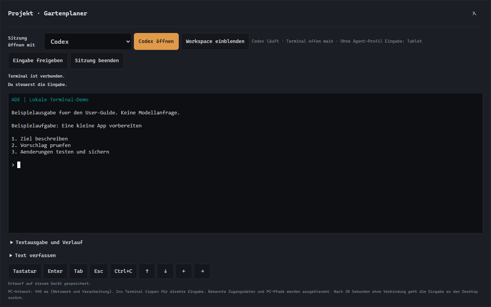

Zum Schreiben ins Terminal tippen oder **Tastatur** drücken. Falls der PC die
Sitzung steuert, zuerst **Eingabe übernehmen** wählen. **Du steuerst die Eingabe**
bestätigt, dass Tasteneingaben vom Tablet angenommen werden.

Der Sitzungsstatus unterscheidet beispielsweise **Claude Code läuft · Terminal
offen** und **Claude Code beendet · Terminal offen**. Im zweiten Fall ist Claude
beendet; Eingaben gehen an die Shell. Die Auswahl **Sitzung öffnen mit** bestimmt
den nächsten Start und ändert die laufende Sitzung nicht. **CLI-Status unbekannt**
bedeutet, dass ADE den Start/Abschluss nicht zuverlässig bestätigen kann.
Manuell in der Shell gestartete Programme werden dabei nicht neu erkannt.
Die vorhandenen Bilder zeigen noch den vorherigen Textstand; der abschliessende
Guide-Task aktualisiert die Aufnahmen zusammen mit dem neuen Projektablauf.

Wenn die Bildschirmtastatur Platz beansprucht, klappt ADE die zusätzlichen
Bedienelemente ein. Über **Bedienung** lassen sie sich wieder öffnen. Enter, Tab,
Esc, Ctrl+C und Pfeiltasten bleiben in der Tastenleiste erreichbar.

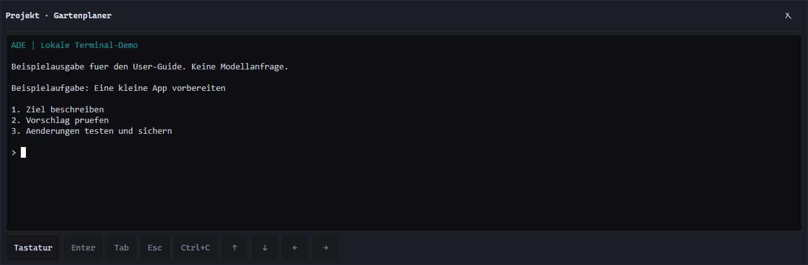

**Text verfassen** eignet sich für längere Texte oder Einfügen aus der
Zwischenablage. **Text und Enter senden** überträgt den Inhalt ausdrücklich.
Ein ungesendeter Terminalentwurf bleibt auf diesem gekoppelten Gerät über
Seitenneuladen erhalten. Er wird nicht automatisch abgeschickt.

**Textausgabe und Verlauf** zeigt einen begrenzten Textverlauf. Die Liveanzeige
unterstützt Farben und Cursor. Nicht jede Desktop-Terminalfunktion ist enthalten,
beispielsweise keine Dateiübertragung oder vollständiges Mausreporting.

**Workspace einblenden** bringt Dateien und andere Werkzeuge zurück.
**Eingabe freigeben** gibt die Steuerung an den Desktop zurück. Nach Verbindungsverlust
läuft die Eingabefreigabe ohne Lebenszeichen nach 30 Sekunden aus.

## 7. Hermes und OpenClaw ohne Projekt

Das Profil muss am PC bereits korrekt eingerichtet sein: eigener Arbeitsordner,
native oder WSL-Umgebung und der funktionierende TUI-Startbefehl. Ein persönlicher
Wrapper gehört zum **gespeicherten Agent-Profil**; die allgemeine Auswahl „Hermes“
ist kein Ersatz für dessen eigene Profilparameter.

In **Overview** beim gewünschten Agenten **Terminal öffnen** wählen. ADE öffnet
das gespeicherte Profil im eigenen Workspace. Ein Repository ist dafür nicht nötig.

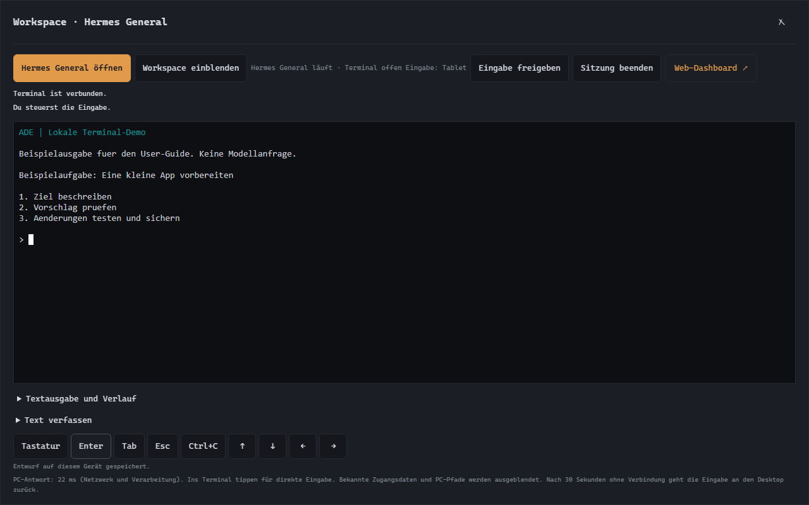

Für die zweite Ansicht **Web-Dashboard** wählen. Der Link öffnet die am PC
hinterlegte private Dashboard-Adresse in einem eigenen Browser-Tab. Das Dashboard
muss separat erreichbar und gegebenenfalls separat angemeldet sein. ADE koppeln
meldet dich nicht automatisch bei Hermes oder OpenClaw an.

Dasselbe Prinzip gilt für **Sentinel/OpenClaw**: gespeichertes Profil für die TUI,
konfigurierte Dashboard-Adresse für die Weboberfläche. Verlauf und Wiederaufnahme
von Unterhaltungen richten sich nach dem jeweiligen Assistenten; ADE garantiert
keine gemeinsame Gesprächssitzung zwischen TUI und Dashboard.

## 8. Dateien behalten und Änderungen sichern

**Dateien sind bereits auf dem PC gespeichert.** Ein Projekt, das du unter deinem
gewünschten Stammordner begonnen hast, muss zum Behalten nicht erst verschoben werden.
Allerdings verwendet ADE für Agent/Projekt-Paare eigene Git-Arbeitskopien
(*Worktrees*) mit eigenem Branch. Neue Änderungen können dort liegen, während der
ursprüngliche Projektordner noch den älteren Stand zeigt.

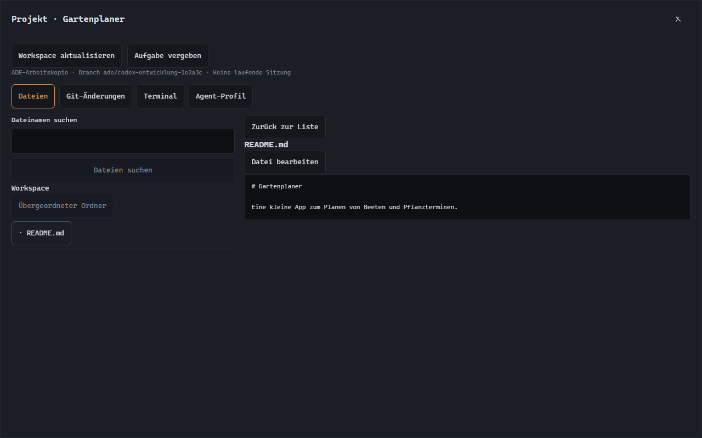

*Nach einem Sitzungswechsel bei Bedarf **Workspace aktualisieren** drücken:
der kurze Arbeitsstatus in der Dateiansicht kann noch den vorherigen Stand zeigen.*

Zum Sichern und Weitergeben:

1. Im aktiven Workspace Dateien sowie **Git-Änderungen** prüfen. Am Desktop
   zeigt der Repository-/Sitzungsbereich den konkreten Branch und Arbeitsort.
2. Änderungen testen und in diesem Branch sichern. In einer interaktiven Sitzung
   kannst du den CLI-Assistenten ausdrücklich um einen geprüften Commit bitten.
3. Den Branch bewusst in deinen gewünschten Hauptstand übernehmen oder über
   deinen Git-/PR-Ablauf veröffentlichen. ADE erledigt das beim Schliessen nicht automatisch.
4. Für eine Sicherung ausserhalb des PCs zusätzlich einen passenden Remote-/Backup-Ablauf nutzen.

**Git-Abgleich** zum Abrufen und Fast-forward-Aktualisieren ist kein allgemeiner
„Meine Änderungen nach main übernehmen“-Knopf. Die geprüfte Integration verwalteter
Runs ist wiederum ein eigener Ablauf. Während solcher verwalteten Aufgaben besitzt
ADE die Git-Metadaten; deren Agents sollen nicht selbst committen oder pushen.

Eine laufende ADE-Arbeitskopie nicht per Explorer verschieben: Git und ADE kennen
ihren bisherigen Ort. Ein späterer Umzug braucht einen bewussten Repository-/Git-
Migrationsablauf. Ein Workspace-Bundle überträgt ADE-Konfiguration nach seinen
[Exportgrenzen](WORKSPACE_BUNDLES.md), es ersetzt kein vollständiges Projektbackup.

Der kleine Mobile-Dateieditor bearbeitet vorhandene UTF-8-Dateien bis 24 KiB.
Während eine Sitzung oder verwaltete Aufgabe diesen Workspace verwendet, kann das
Speichern gesperrt sein. Datei- und Profilentwürfe sind derzeit nur im Seitenspeicher:
vor Neuladen sichern. Das unterscheidet sie von Terminal-/Auftragsentwürfen.

## 9. Aufgaben und Runs

Wenn du nicht selbst im Terminal arbeiten möchtest, öffne **Work → Neue Aufgabe**.
Wähle Projekt und Agent und beschreibe ein abgegrenztes Ergebnis samt Prüfschritten.
Eine solche Aufgabe läuft über ADEs verwalteten Ablauf.

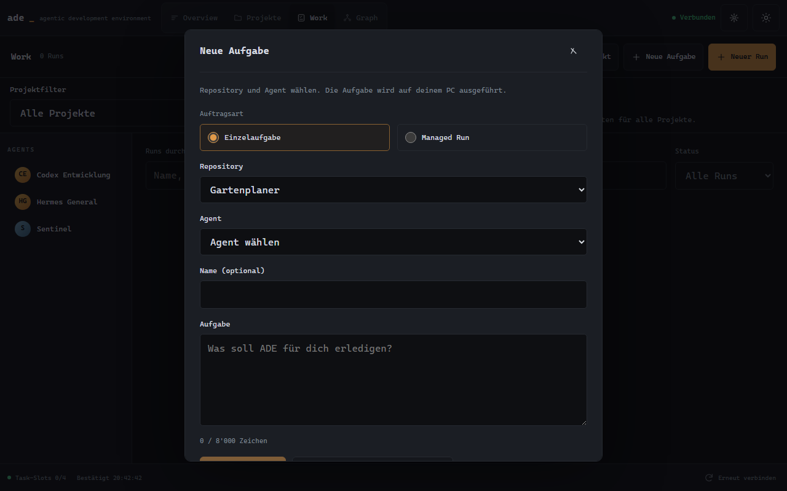

**Neuer Run** ist für koordinierte Arbeit mit mehreren Agents gedacht. Projekt,
Team, Grenzen und Auftrag festlegen; vorbereiten und ausdrücklich starten.
**Work** zeigt Fortschritt und Status, **Graph** die Beteiligten und Beziehungen.
Die Task-Slots gelten über alle Projekte hinweg.

Beginne mit einer kleinen Einzelaufgabe, bevor du ein Team zusammenstellst.
CLI-Verfügbarkeit allein ist kein Nachweis, dass deren verwalteter Adapter jeden
Run-Typ unterstützt. Den gemessenen Stand nennt [STATUS.md](STATUS.md).
Integrationsfreigabe und verifiziertes Publishing bleiben Desktop-Abläufe. Ein gestarteter Run veröffentlicht nicht automatisch.

### Ergebnis und Bild auf dem Tablet abrufen

1. Unter **Work** den betreffenden Run öffnen, oder in **Graph** den Run auswählen
   und auf seinen Agent-Knoten tippen.
2. In den Run-Details zu **Aktivität & Ergebnis** gehen. **Aktivität** zeigt den
   bestätigten Prozesszustand und die zuletzt empfangenen CLI-Schritte.
3. **Ergebnis** zeigt die gespeicherte Abschlussantwort. Bei älteren Runs kann sie
   fehlen; das wird ausdrücklich angezeigt. „Completed“/Exit 0 bedeutet zunächst,
   dass der Prozess erfolgreich beendet wurde — die Antwort und Dateien prüfen.
4. **Dateien → Bild ansehen: …** öffnet eine Vorschau. **Herunterladen: …** speichert
   das Bild über Chrome auf dem Tablet. Für Tabellen oder Markdown zuerst
   **Download vorbereiten: …**, dann **Herunterladen: …** wählen.

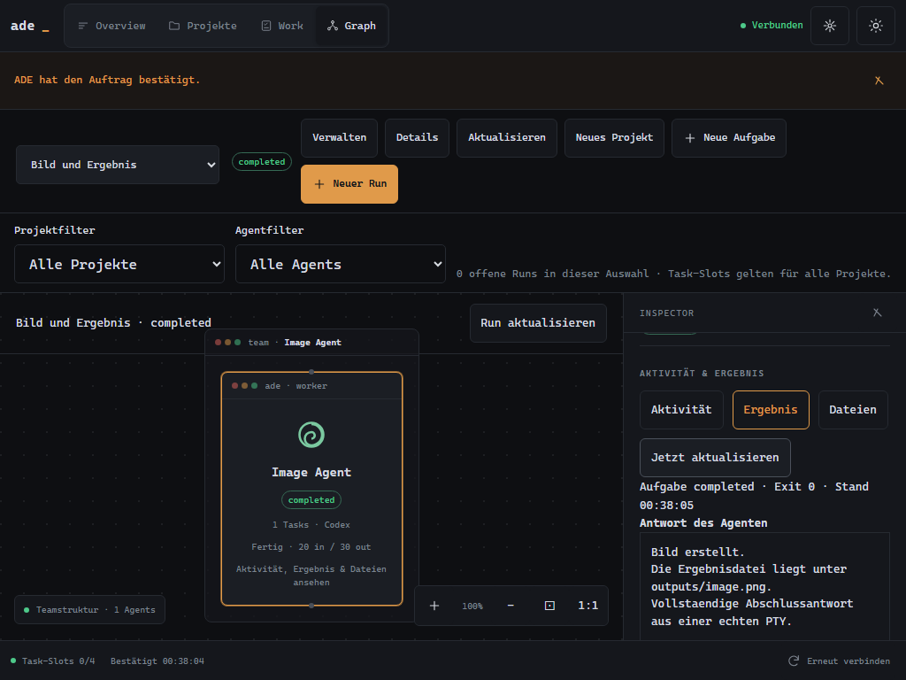

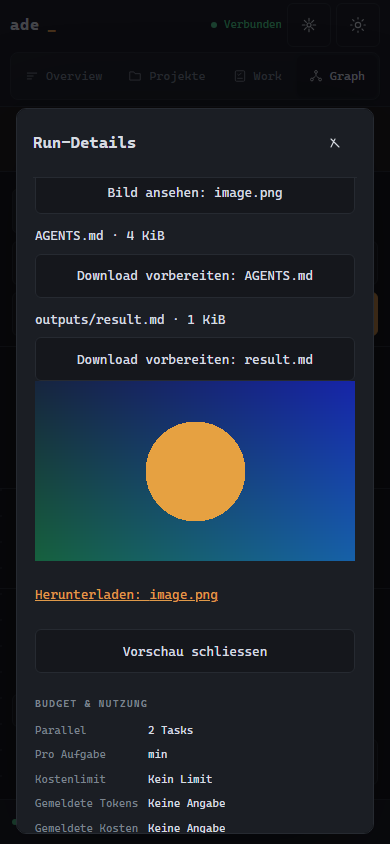

Diese Screenshots stammen aus einem isolierten Test mit deterministischer CLI und
einer echten Terminal-Sitzung; das farbige Testbild ist kein Modell-Qualitätsbeleg.
Die Liste enthält Dateien des Auftrags-Workspaces, möglicherweise auch frühere
Arbeiten. Unterstützt: PNG/JPEG/WebP, XLSX, Markdown, TXT und CSV bis 16 MiB je
Datei. Während ein Bild noch geschrieben wird, später **Jetzt aktualisieren**
wählen. Wurde der ursprüngliche Workspace entfernt, Dateien am PC wiederfinden.

Falls die Lesefreigabe fehlt: am PC unter **Settings → Geräte** für das gekoppelte
Tablet **Workspace-Dateien und Git-Diffs lesen** aktivieren. Die Vorschau benötigt
eine Verbindung zum PC. Bei einem alten Browserstand ADE in Chrome neu laden.

## 10. Pausieren, weiterarbeiten und aktualisieren

| Aktion | Wirkung |
|---|---|
| Workspace-Dialog am Tablet schliessen | Terminal läuft auf dem PC weiter |
| Browser neu laden | ADE verbindet sich wieder; bestehende PC-Sitzung kann erneut geöffnet werden |
| Eingabe freigeben | Prozess läuft weiter, Desktop übernimmt die Eingabe |
| Sitzung beenden + bestätigen | Der ausgewählte Terminalprozess wird beendet |
| ADE-Fenster schliessen, mobiler Zugriff aktiv | ADE bleibt im Infobereich des PCs aktiv |
| ADE im Tray vollständig beenden / PC neu starten | Laufende Terminalprozesse enden; Dateien bleiben bestehen |

Zum Weiterarbeiten dasselbe Projekt bzw. denselben Agenten öffnen und eine
bestehende Sitzung verwenden. Nach einem vollständigen ADE-Neustart muss die CLI
neu gestartet werden. Ob ein früheres Gespräch fortgesetzt werden kann, hängt
von deren eigener Resume-/Verlaufsfunktion ab.

Für einen **Windows-Quellcode-Update** erst aktive Arbeit abschliessen, ADE über
das Tray vollständig beenden und im ADE-Repository ausführen:

```powershell
git pull --ff-only
pnpm install --frozen-lockfile
pnpm build
pnpm start
```

Danach Chrome neu laden. Lokale Änderungen bei einem Git-Konflikt zuerst erhalten
und prüfen. Ein Build allein ersetzt die Mobile-Dateien eines bereits laufenden
Hosts nicht. Die Gerätekopplung bleibt bei normalem Update mit demselben Profil
erhalten. Ein automatischer Updater ist noch nicht vorhanden.

## 11. Wenn etwas nicht funktioniert

| Beobachtung | Nächster sinnvoller Schritt |
|---|---|
| Offline / Verbindung wird hergestellt | PC wach und ADE aktiv? Beide Geräte in Tailscale verbunden? Am PC **Verbindung prüfen**, am Tablet **Erneut verbinden**. Bei festhängendem Android-VPN Tailscale neu verbinden; danach Chrome neu laden. |
| Tailscale verbunden, Chrome erreicht ADE trotzdem nicht | Die Adresse aus ADE verwenden. Chrome darf in Tailscale nicht ausgeschlossen sein. Gerätezeit automatisch synchronisieren. Bei Namens-/Zertifikatsfehlern die konkrete Meldung und PC-HTTPS-Prüfung untersuchen. |
| Projekte oder neuer Einstieg fehlen | Mobile-Seite nach einem vollständigen ADE-Update neu laden; prüfen, ob am PC wirklich der neue Host läuft. |
| Neues Projekt meldet fehlende Einrichtung | Am PC Stammordner speichern; Projektverwaltung und Terminalrecht für genau dieses gekoppelte Gerät freigeben. |
| Workspace lässt sich nicht vorbereiten | Leserecht und bei neuer Arbeitskopie Projektverwaltungsrecht prüfen; angezeigten Backend-/Git-Fehler am PC lösen. |
| Keine Tastatur | Zuerst **Eingabe übernehmen**, dann ins Terminal tippen oder **Tastatur** drücken. Eine beendete Sitzung zuerst neu öffnen. |
| Tippen wirkt verzögert | Angezeigte PC-Antwortzeit notieren, lokalen Desktop vergleichen, WLAN/Tailscale-Verbindung prüfen. Dieser Wert enthält Netzwerk und PC-Verarbeitung; er ist keine reine Funklatenz. |
| Eingabe möglicherweise angekommen | **Eingabestatus prüfen** und Ausgabe lesen; denselben Befehl nicht blind erneut senden. |
| Dateien lassen sich nicht speichern | Aktive Sitzung/Lease und Dateigrösse prüfen; bei Konflikt den aktuellen Inhalt mit dem Entwurf zusammenführen. |
| CLI fehlt / Anmeldung schlägt fehl | Installation und Anmeldung am PC in der richtigen Windows-/WSL-Umgebung prüfen. |
| Dashboard verlangt Anmeldung | Separate Anmeldung im Dashboard durchführen; ADE-Terminal und Dashboard bleiben eigenständige Zugänge. |
| Gerät verloren oder nicht mehr verwendet | Am PC unter **Verbundene Geräte** Zugriff widerrufen. Lokales Trennen im Browser ersetzt den Widerruf nicht. |

Tailscale dokumentiert, dass ausgeschlossene Android-Apps sowohl Routing als auch
DNS an Tailscale vorbeiführen. [Android-App-Ausnahmen](https://tailscale.com/docs/features/client/android-app-split-tunneling).
ADE nutzt private Freigaben im Tailnet; [Tailscale Serve](https://tailscale.com/docs/features/tailscale-serve)
beschreibt dieses Zugriffsmodell. Für ADE keine öffentliche Portfreigabe einrichten.

Für eine Fehlermeldung helfen: ADE-Ansicht, gewähltes Projekt/Profil, Zeitpunkt,
Verbindungsstatus, ob der Desktop dieselbe Störung zeigt und ein Screenshot ohne
Zugangsdaten. Weitere Details: [Verbindung einrichten](goal8/MOBILE_CONNECT_GUIDE.md),
[Terminalfreigaben](REMOTE_TERMINAL_GUIDE.md), [Dokumentationsübersicht](README.md).
