# ADE User-Guide

## Eine Sitzungsantwort anhören

Im Terminal **Antwort anhören** wählen. Eine Textmarkierung wird bevorzugt;
sonst wird der sichtbare Ausschnitt übernommen. Auf dem Tablet kann auch der
**Verlauf** geöffnet und darin Text markiert werden. Unter **Text zum Vorlesen**
die gewünschte Antwort behalten, **Sprechtext prüfen**, dann **Anhören**.
**Stoppen** bricht ab; **Erneut abspielen** verwendet das vorhandene Audio.
Einstellungen → Stimme gilt auch hier. [Details und Grenzen](REPLY_SPEECH.md).

## Stimme persönlich einstellen

Auf PC und Tablet **Settings/Einstellungen → Stimme → Stimmen laden** öffnen.
**Tempo** macht die Stimme langsamer oder schneller; der neue Standard ist 0.85.
Weitere Regler passen Stabilität, Stimmähnlichkeit und Stil an; Speaker Boost
lässt sich ein- und ausschalten. **Stimme testen** hört den Entwurf vor, ohne
ihn zu speichern. **Parameter speichern** übernimmt ihn für PC und Tablet,
einschliesslich der Computer-Begrüssung. **Änderungen verwerfen** holt den
gespeicherten Stand zurück. **Ruhiger Computer** lädt ein noch zu speicherndes
Preset. [Details](VOICE_SETTINGS.md).

Für die tägliche Arbeit mit mehreren Repositories beginne unter **Projekte**.
Die gemeinsame Sitzungsübersicht steht unter **Work → CLI-Arbeit**; der
Prompteditor mit Diktat sitzt direkt im gewünschten Terminal.

Stand: 16. September 2026 · Einstieg mit Windows-PC und Samsung-Tablet/Chrome.
Die unten datierten Screenshots zeigen frühere, weiterhin geltende Grundabläufe.

ADE bündelt deine Projekte, CLI-Assistenten und Aufgaben. Programme und Dateien
liegen auf dem PC. Das Tablet bedient ADE über eine private Verbindung; es muss
die Entwicklungswerkzeuge nicht selbst installieren.

**Der neue Projekteinstieg: Projekte → Workspace öffnen.** Zuerst siehst du
„Meine ADE Projekte“. Unter **Alle** findest du auch Ordner unter deinem
Projekt-Stamm, die noch nicht in ADE erfasst sind. ADE merkt sich deine ausdrücklich
gewählte Filteransicht auf diesem Gerät. Der geöffnete
Workspace zeigt seinen tatsächlichen Branch und benötigt kein Agent-Profil.
Unter **Branches** den Branch wählen und die Aktion prüfen. Danach unter
**Sitzung öffnen mit** (Desktop: **Arbeiten mit**) Codex, Claude CLI, Grok CLI oder die Shell öffnen. Ein gespeichertes
Profil kannst du ausdrücklich unter den weiteren Startoptionen wählen.
Für eine neue Idee verwendest du **Neues Projekt**. Für Hermes General oder
Sentinel ohne Projekt verwendest du **Overview → Terminal öffnen** beim Agenten.

Die Bilder zeigen echte ADE-Oberflächen mit Beispieldaten aus einer isolierten
Windows-/Chromium-Instanz. Terminalprogramme sind lokale Demos, keine echten
Modellantworten. Bild 10 simuliert den verfügbaren Platz über einer Bildschirmtastatur;
es ist keine Aufnahme einer Samsung-Tastatur. Pairing-Daten und der temporäre
Projektpfad sind maskiert. [Aufnahmeprotokoll](media/user-guide/capture.json).

Für die neue Ordnerübersicht am Tablet am PC unter **Settings → Verbundene Geräte**
die Rechte **Workspace-Dateien und Git-Diffs lesen** und **Projekt-Workspaces ohne
Agent-Profil öffnen** freigeben. Für Branch-Aktionen zusätzlich **Projekt-Branches und lokale Git-Aktionen ausführen**, für die CLI **Interaktive Terminals steuern** freigeben.
Danach **Projektordner aktualisieren** verwenden.
Normale Ordner ohne Git werden angezeigt; Git wird darin nicht automatisch angelegt.
Bei einer verlorenen Antwort **Workspace-Öffnung prüfen** wählen. ADE verwendet
dieselbe Aktion erneut, auch nach einem Neuladen der Seite.

Die Einstiegsbilder wurden für den unabhängigen Projektablauf aktualisiert.
Zusätzliche Branch-, Git- und Ergebnisbilder stammen aus den jeweiligen Prüfläufen.

## Inhalt

- [1. Den richtigen Einstieg wählen](#1-den-richtigen-einstieg-wählen)
- [2. ADE einmal am PC einrichten](#2-ade-einmal-am-pc-einrichten)
- [3. Das Tablet verbinden](#3-das-tablet-verbinden)
- [4. Ein neues Projekt beginnen](#4-ein-neues-projekt-beginnen)
- [5. In einem bestehenden Projekt arbeiten](#5-in-einem-bestehenden-projekt-arbeiten)
- [6. Terminal und Tastatur bedienen](#6-terminal-und-tastatur-bedienen)
- [7. Hermes und OpenClaw ohne Projekt](#7-hermes-und-openclaw-ohne-projekt)
- [8. Dateien behalten und Änderungen sichern](#8-dateien-behalten-und-änderungen-sichern)
- [9. Aufgaben und Runs](#9-aufgaben-und-runs)
- [10. Pausieren, weiterarbeiten und aktualisieren](#10-pausieren-weiterarbeiten-und-aktualisieren)
- [11. Wenn etwas nicht funktioniert](#11-wenn-etwas-nicht-funktioniert)

## 1. Den richtigen Einstieg wählen

| Dein Vorhaben | Dein Weg in ADE Mobile |
|---|---|
| Bestehenden Code bearbeiten | **Projekte → Projekt → Workspace öffnen → Sitzung öffnen mit** |
| Eine neue Idee ausprobieren | **Neues Projekt → Name → Projekt anlegen und öffnen**, danach CLI wählen |
| Mit einem persönlichen Assistenten sprechen | **Overview → Terminal öffnen** beim Agenten |
| Hermes-/OpenClaw-Weboberfläche verwenden | **Web-Dashboard** beim entsprechend eingerichteten Agenten |
| Eine abgegrenzte Arbeit delegieren | **Work → Neue Aufgabe** |
| Mehrere Agents koordiniert arbeiten lassen | **Work → Neuer Run**, danach Fortschritt in **Work/Graph** |

Ein **Projekt** ist ein registriertes Git-Repository. Ein **Agent** ist ein
gespeichertes Profil mit Name, Startprogramm und Einstellungen; eine feste
Projektzuweisung ist optional. Persönliche Assistenten können einen eigenen
Arbeitsordner haben.
Ein **Workspace** ist das konkrete Arbeitsverzeichnis. Eine **Sitzung** ist ein
laufendes Terminalprogramm. Ein **Run** ist ein von ADE verwalteter Aufgabenablauf.

**Prompt und Diktat:** Im gewünschten Terminal **Prompt / Diktat** öffnen.
Anmeldung und Projektvertrauen vorher direkt in der CLI abschliessen. Text tippen
oder **Diktieren → Aufnahme stoppen** verwenden, das Transkript bearbeiten und
erst danach **In CLI einfügen** oder **An CLI absenden** wählen. Letzteres sendet
zusätzlich Enter. Live-Aufnahmen auf PC und Tablet enden spätestens nach
5 Minuten; diese Grenze setzt ADE. Die Mikrofonfreigabe zählt nicht zur Aufnahmezeit.
Während der Aufnahme erscheinen bestätigte
Abschnitte zusammen mit dem noch veränderlichen Zwischenstand. Das Ziel bleibt
sichtbar und gebunden; ein Entwurf wechselt nicht mit einem anderen Projekt.

Am PC einen `ELEVENLABS_API_KEY` unter **Settings → Service-Keys** für alle
Sessions hinterlegen. Auf dem Tablet zusätzlich unter **Verbundene Geräte**
die separate Diktatfreigabe und Terminalsteuerung einschalten; der HTTPS-Browser
fragt beim Aufnehmen nach Mikrofonzugriff. Der Schlüssel bleibt auf dem PC.
Desktop und Tablet verwenden denselben Editor, speichern ihre Entwürfe jedoch
lokal im jeweiligen Browserprofil; Entwürfe werden nicht zwischen Geräten
synchronisiert. Bei unbestätigtem Versand bleibt der Text erhalten: zuerst die
CLI-Ausgabe prüfen, dann den Entwurf wieder freigeben. Es gibt keinen automatischen
zweiten Versand.

**Computer live testen:** Im selben Fenster **Computer testen** wählen. Sobald
„Ich höre zu“ erscheint, **Computer** sagen. Die Standardstimme begrüsst dich
persönlich; der Text erscheint daneben. **Computer-Test beenden** stoppt den
Ablauf. **Begrüssung abspielen** wiederholt das empfangene Audio. Der Test hört
höchstens 20 Sekunden zu; Fenster und Tablet-Browser im Vordergrund lassen.
Auf dem Tablet braucht es zusätzlich die Gerätefreigabe **Stimmen wählen und
ElevenLabs-Stimmtests ausführen**. Stimme unter **Settings → Sprachausgabe**
wählen. Danach kannst du mit **Diktieren** die nächste Aufgabe vorbereiten.
Arbeitsrückblick und weitere Sprachbefehle folgen als nächste Ausbaustufe.

Die strukturierte Promptübergabe gilt zunächst für neue native Windows-Sitzungen
mit Codex, Claude Code und Grok, sofern die CLI das Paste-Protokoll aktiviert hat.
WSL-Assistenten und eigene Startbefehle verwenden weiterhin ihre direkte
Terminaleingabe. Der lokale Tablet-Browserablauf ist automatisiert geprüft;
physisches Mikrofon und die eigene Mobilverbindung separat ausprobieren.
[Abnahme und Grenzen](DICTATION_IMPLEMENTATION_RESULTS.md).

Du brauchst keinen Run, um interaktiv mit Codex, Claude oder Grok zu arbeiten.

**Am PC zwischen laufenden Arbeiten wechseln:** Unter **Work → CLI-Arbeit**
stehen deine interaktiven Sitzungen, in **Overview** dieselbe Liste kompakt.
Eine Zeile öffnet das vorhandene Terminal. Mit **Benennen** gibst du der Sitzung
einen Arbeitstitel; über Projekt, Profil, CLI, Status oder Suche findest du sie
wieder. **Originalordner** bedeutet die ursprüngliche Arbeitskopie, **Worktree**
eine separate. Der Branch in dieser Liste ist der Branch beim Start. Nach einem
externen Branchwechsel zuerst den Arbeitsort unter **Projekte** prüfen.
**Neue Ausgabe** heisst nur, dass neuer Terminaltext vorhanden ist. Eine
beendete CLI mit noch offener Shell ist keine automatisch abgeschlossene Aufgabe.
Titel bleiben beim Neuladen erhalten; ein vollständiger App-Neustart stellt
keinen alten Prozess wieder her. Die Projektkarte in Overview öffnet den
vorhandenen Originalworkspace direkt.


*Overview ist der gemeinsame Überblick. Für die tägliche Arbeit an Code führt der
Reiter Projekte direkt zum gewünschten Arbeitsbereich.*

## 2. ADE einmal am PC einrichten

Öffne oben **Einrichtung**. In einem leeren ADE kannst du auch **ADE jetzt
einrichten** wählen. Die vier Schritte führen durch Projektordner, **CLI prüfen**,
**Tablet verbinden** und **Freigaben prüfen**. Speichere zuerst den gewünschten
Projekt-Stammordner. Die CLI-Prüfung zeigt Installation und Anmeldung; eine
fehlgeschlagene Prüfung lässt sich wiederholen. Sie startet keinen Auftrag.

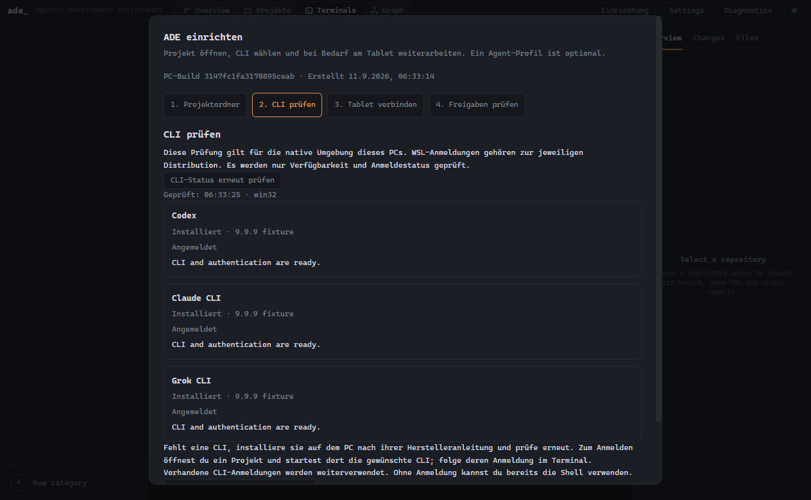

*Native CLI-Prüfung mit lokalen Testprogrammen. Ein gespeichertes Agent-Profil ist
für diesen Weg nicht erforderlich; die Anzeige bestätigt keine Modellantwort.*

Über **Zu den Projekten** wechselst du jederzeit in die Projektübersicht. Wähle
dort den Workspace und öffne deine CLI. Falls die Anmeldung fehlt, folge deren
Anmeldung im Terminal. Die beiden Tablet-Schritte sind optional für reine
Desktop-Arbeit. Bestehende Einstellungen findest du weiterhin unter **Settings**.

Für diesen Guide wird ADE auf nativem Windows gestartet. Windows mit einem
WSL-Backend, eine native Linux-/WSLg-App und macOS sind unterschiedliche
Installationsmodelle. Ihre Nachweise und Grenzen stehen in
[MULTIPLATFORM_PLAN.md](MULTIPLATFORM_PLAN.md); diese Anleitung verspricht keine
gleichwertige Einrichtung auf allen Plattformen.

Wenn ADE bereits läuft, beginne bei **Startprogramm und Anmeldung prüfen**.
Für einen Start aus dem Quellcode benötigst du Git, Node.js 22 und pnpm 9.15.9
(die im Repository verwendete Werkzeuglinie). Bei einem frischen Windows-Setup
können zusätzlich native Build-Werkzeuge für `node-pty` erforderlich sein;
bei Installationsfehlern zuerst dessen Build-Ausgabe prüfen.

```powershell
git clone https://github.com/McMuff86/ade.git
cd ade
pnpm install --frozen-lockfile
pnpm build
pnpm start
```

`pnpm build` erstellt Desktop und Tablet aus demselben Quellstand. `pnpm start`
startet genau diesen Build ohne erneutes Bauen. Nach Codeänderungen zuerst wieder
`pnpm build` ausführen. Eine bereits laufende ADE-Instanz vorher vollständig
beenden: im Windows-Infobereich mit Rechtsklick auf ADE → **ADE und mobilen
Zugriff beenden**. Das Fensterschliessen lässt den mobilen Host weiterlaufen;
`pnpm start` öffnet dann nur dessen Fenster und der bisherige Build bleibt aktiv.

**Startprogramm und Anmeldung prüfen:** Installiere die gewünschte CLI nach deren
Herstelleranleitung auf dem PC und melde dich dort an. In ADE **Settings** öffnen
und beim jeweiligen Harness den Installations-/Anmeldestatus prüfen. Ein vorhandenes
Programm bedeutet noch nicht, dass dein Konto jedes Modell verwenden darf.
Windows und WSL haben getrennte Installationen, PATHs und Anmeldungen.

**Optional ein Profil:** Für Projektarbeit brauchst du kein Profil. Für einen
wiederverwendbaren Assistenten in **Terminals** eine **New category** anlegen, etwa
„Entwicklung“, und darin über **Add agent** einen Agenten erstellen. Name und
Runtime wählen, etwa „Codex Entwicklung“ und Codex. Für den Einstieg die normale
Berechtigungsstufe verwenden. Modell und Reasoning nach der tatsächlich geladenen
Auswahl wählen; bei Ladefehlern zuerst die Meldung prüfen. Die dynamische
Modellauswahl befindet sich derzeit am Desktop. Gespeicherte Einstellungen gelten
beim Start des gespeicherten Profils.


**Bestehende Projekte:** Unter **Projekte** erscheinen die direkten Unterordner
des eingestellten Projekt-Stamms. Ein Git-Projekt über **Workspace öffnen**
auswählen; ADE registriert den bestehenden Checkout. Für einen Ordner ausserhalb
des Stamms oder einen WSL-Eintrag: In **Terminals** einen Agenten wählen.
Im Repository-Bereich **⋯ → Add repo** öffnen und den bestehenden Git-Ordner
auswählen. **Pfad…** erlaubt die direkte Pfadeingabe und eine ausdrückliche
Backend-Wahl. Importieren registriert das Repository; es verschiebt den Ordner nicht.

**Speicherort für neue Projekte:** In **Settings → Projekt-Stammordner**
den **Projekt-Stammordner** wählen. Für Adis PC ist
`C:\Users\Adi.Muff\repos` sinnvoll, allgemein `C:\Users\<Name>\repos`.
**Projektstart speichern** drücken. Ein Profil ist dafür nicht erforderlich.
Bestehende Projekte behalten ihren bisherigen Speicherort.


*Ein neues Projekt bekommt direkt einen eigenen Ordner unter diesem Stammordner.
Den Unterschied zum unabhängigen Checkout erklären wir in Abschnitt 8.*

## 3. Das Tablet verbinden

1. Tailscale auf PC und Tablet verbinden. Beide Geräte müssen zum selben Tailnet
   gehören und sich erreichen dürfen. MagicDNS und HTTPS müssen verfügbar sein.
2. Am PC **Settings → Mobiler Zugriff → Mit Tailscale aktivieren** wählen.
3. **Tablet oder Smartphone koppeln** drücken. Den QR-Code mit dem Tablet scannen
   oder die angezeigte ADE-Adresse in Chrome öffnen und den Pairing-Code eingeben.
4. Einen Gerätenamen, etwa „Mein Samsung Tablet“, setzen und **Dieses Gerät verbinden** drücken.
5. Auf **Verbunden** warten. Der Code ist einmalig und fünf Minuten gültig.


Der Gerätename ist ein Anzeigename in ADE; er ändert nicht die Tailscale-Adresse
des PCs. Eine erfolgreiche Kopplung und die Freigabe zusätzlicher Funktionen
sind getrennte Schritte.

Am PC **Settings → Verbundene Geräte → Geräte aktualisieren** wählen. Für den
vollständigen Projekteinstieg die folgenden Rechte setzen und
**Verwaltungsrechte speichern** drücken:

Einfacher geht es unter **Einrichtung → Freigaben prüfen**: Beim gewünschten
Gerät **Projektarbeit auswählen** drücken, die gesetzten Schalter prüfen und
**Verwaltungsrechte speichern** wählen. Die Vorauswahl ergänzt bestehende Rechte.
**Dateilesen auswählen** setzt nur das Leserecht für Workspace- und Ergebnisdateien.
**Push/PR auswählen** ergänzt die Rechte zum Veröffentlichen ausdrücklich.
Projektarbeit allein schaltet weder Push/PR noch den ADE-Neustart frei.

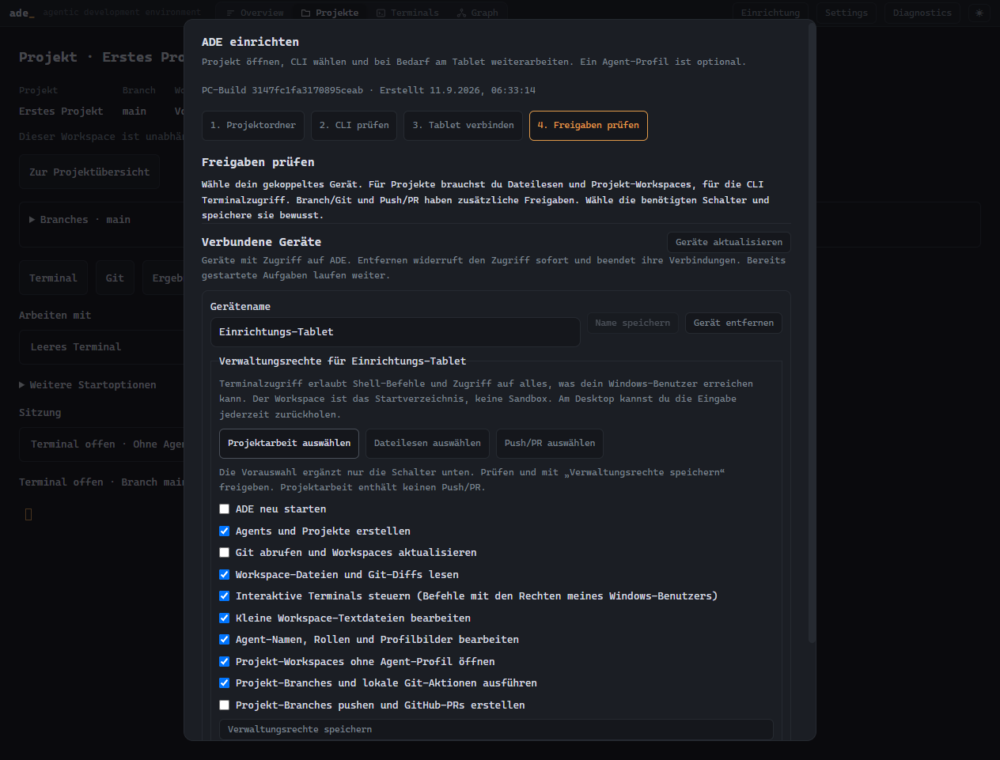

| Recht | Wann du es brauchst |
|---|---|
| Agents und Projekte erstellen | Neue Projekte oder eine neue Projekt-Arbeitskopie vorbereiten |
| Workspace-Dateien und Git-Diffs lesen | Projektworkspace, Dateien und Änderungen öffnen |
| Projekt-Workspaces ohne Agent-Profil öffnen | Vorhandenen Checkout unabhängig öffnen |
| Projekt-Branches und lokale Git-Aktionen ausführen | Branch wählen, Commit, Merge und Fetch |
| Projekt-Branches pushen und GitHub-PRs erstellen | Branch nach einer konkreten Vorschau veröffentlichen |
| Interaktive Terminals steuern | CLIs starten und darin schreiben |
| Kleine Workspace-Textdateien bearbeiten | Optional: vorhandene Textdateien direkt im ADE-Dateieditor ändern |


Terminalzugriff erlaubt Befehle mit den Rechten des PC-Benutzers. Der gewählte
Workspace ist das Startverzeichnis. Vergib diese Freigabe bewusst an dein eigenes
Gerät. Tailscale allein ersetzt diese ADE-Freigabe nicht.

Am Tablet unter **Settings → Einrichtung auf diesem Gerät** dein Vorhaben wählen.
ADE nennt die fehlenden Schalter genauso wie am PC. Nach dem Speichern verbindet
sich dasselbe Tablet erneut; **Einrichtungsstatus aktualisieren** prüft zusätzlich
den aktuellen Stand. Installation und Anmeldung der CLI werden separat am PC
unter **Einrichtung → CLI prüfen** geprüft.

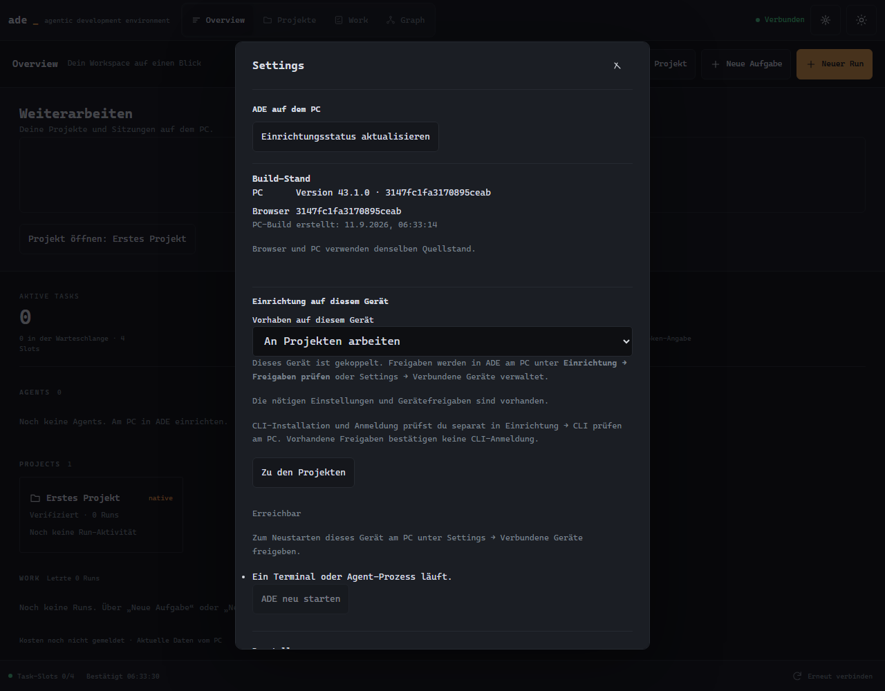

Unter **Build-Stand** vergleichst du PC und Browser. Unterschiedliche Kennungen:
Entwürfe sichern und Chrome neu laden; bleibt der Unterschied, ADE am PC mit dem
aktuellen Build vollständig neu starten. „Build nicht gemeldet“ bei älteren Hosts
bedeutet unbekannt. Offline zeigt ADE den letzten PC-Stand ausdrücklich ohne
aktuelle Bestätigung. ADE lädt die Seite nicht selbstständig neu.

Optional ADE über Chromes Installations-/Startbildschirmfunktion ablegen.
Eine separat gespeicherte Browser-/PWA-Installation kann eine eigene Kopplung
benötigen. Der PC muss eingeschaltet, angemeldet und erreichbar bleiben.

## 4. Ein neues Projekt beginnen

1. In ADE Mobile **Neues Projekt** drücken, beispielsweise auf **Projekte**.
2. Einen Namen eingeben, etwa „Mein Notizbuch“. Ohne Namen erzeugt ADE einen.
3. **Projekt anlegen und öffnen** drücken. ADE legt den dauerhaften Projektordner
   mit einem Git-Repository und Branch **main** an.
4. Im Projekt bei Bedarf einen Branch anlegen und unter **Sitzung öffnen mit** (Desktop: **Arbeiten mit**) Codex,
   Claude CLI, Grok CLI oder die Shell wählen. **… öffnen** startet die Sitzung.

Dabei entsteht kein Agent-Profil. Auf dem Desktop findest du **Neues Projekt**
im Reiter **Projekte**. Es wird kein GitHub-Repository automatisch veröffentlicht.


Ein guter erster Auftrag wäre:

> Ich möchte eine kleine Notiz-App. Schlage zuerst ein einfaches Grundgerüst vor.
> Erstelle danach eine startbare erste Version und erkläre, wie ich sie teste.

Bei einer unterbrochenen Antwort **Start fortsetzen** verwenden. ADE prüft den
bereits begonnenen Vorgang; kein zweites Projekt nur wegen einer Warteanzeige anlegen.
**Startablauf schliessen · erstellte Arbeit behalten** beendet den Startablauf,
ohne bereits angelegte Projektdateien zu löschen.

## Terminal ohne Agent und Projekt öffnen

Am Desktop kannst du bei **Terminals → Terminal öffnen → Workspace** auch direkt
ein Projekt wählen. Danach Codex oder Claude auswählen und **Sitzung starten**.
ADE zeigt vorher den Branch. Ein dem Projekt zugewiesener Agent ist dafür nicht
erforderlich. Neue Ordner zuerst unter **Projekte** hinzufügen.

Im geöffneten Projekt stehen **Codex öffnen**, **Claude Code öffnen** und
**Leeres Terminal öffnen** direkt bereit. **Zusätzliche Sitzung starten** öffnet
ein weiteres Terminal. Unter **Arbeiten mit → Gespeichertes Agent-Profil** kannst
du ein vorhandenes Profil ausdrücklich für diesen Workspace auswählen.

Die Sitzungen erscheinen als Tabs. **Ctrl+PageUp/PageDown** wechselt die Sitzung,
**Ctrl+Shift+T** startet eine zusätzliche und **Ctrl+Shift+W** schliesst sie nach
Bestätigung. Beim Wechsel zwischen Terminal und Git bleibt die Auswahl erhalten.

Über dem Terminal findest du **Kopieren**, **Einfügen**, **Suchen**,
**Verlauf-Anfang**, **Zur Live-Ausgabe** und die gespeicherte Schriftgrösse.
**Ctrl+Shift+F** durchsucht den vorhandenen Terminalverlauf; Enter/Shift+Enter
wechselt Treffer, Escape bringt den Fokus zurück ins Terminal. Ctrl+C kopiert
bei markiertem Text; ohne Markierung erreicht es weiterhin das laufende Programm.

Am Desktop **Terminals → Terminal öffnen** wählen. Im Dialog **Leeres Terminal**,
**Codex**, **Claude CLI** oder **Grok CLI** auswählen und **Sitzung starten** drücken.
Mit **Workspace → Benutzerverzeichnis** beginnt die Sitzung im Benutzerverzeichnis
des ADE-Rechners. Mit **Freie Terminals**
links kehrst du zu diesen Sitzungen zurück. Du kannst die CLI auch selbst in der
Shell starten; ADE zeigt den CLI-Status nur für den von ADE gestarteten Aufruf.

Auf Mobile **Terminals** oder **Terminal öffnen** wählen. Die linke Navigation zeigt
Agents und bestehende Sitzungen; auf dem Telefon erreichst du sie über
**Agents und Sitzungen**. Mit **Eingabe übernehmen** bedienst du eine vorhandene
Desktop-Sitzung. **Neue Sitzung starten** öffnet eine weitere Sitzung.
**Schriftgrösse**, **Terminal vergrössern**, Theme und Tastaturhilfen passen die
Ansicht an dein Gerät an. Das Terminal läuft auf dem ADE-Rechner.

Für freie Terminals muss das Gerät am PC **Interaktive Terminals steuern** und
Zugriff auf **Alle** Ressourcen erhalten. Installation und Anmeldung der CLI
erfolgen in der nativen Umgebung des ADE-Rechners. [Details und Abnahmestand](TERMINAL_WORKSPACE.md).

## 5. In einem bestehenden Projekt arbeiten

Auf dem Tablet kannst du oben über **Projektbereich** die Projektdetails und
Aktionen einklappen. Das Terminal erhält den frei werdenden Platz; derselbe
Schalter blendet den Bereich wieder ein. Die Auswahl bleibt beim Neuladen
erhalten. **Workspace-Info** ist auch eingeklappt verfügbar. Auf breiten Tablets
stehen **Workspace aktualisieren** und **Branches** neben den Bereichsschaltern.

1. **Projekte** öffnen und das gewünschte Projekt suchen.
2. Die Projektkarte und danach **Workspace öffnen** wählen.
3. **Branches** aufklappen, den gewünschten Branch auswählen und die Vorschau
   prüfen. Für parallele Arbeit einen neuen Branch mit **Zusätzliche Arbeitskopie
   anlegen** verwenden. Ungesicherte Dateien bleiben im bisherigen Workspace.
4. Am Desktop direkt **Codex öffnen**, **Claude Code öffnen** oder **Leeres Terminal öffnen**
   wählen. Weitere CLIs und Profile unter **Arbeiten mit → Auswahl öffnen / fortsetzen**.
   Auf Mobile unter **Sitzung öffnen mit** auswählen und **… öffnen** drücken.


**Workspace öffnen** startet noch keine CLI. Es öffnet den vorhandenen Checkout
ohne Agent-Bindung. Ein gespeichertes **Startprofil** verwendet seine Einstellungen
im gewählten Checkout; es wechselt nicht in dessen Agent-Ordner. Fehlt die CLI,
am PC Installation und Anmeldung in der angezeigten Umgebung prüfen.

Existiert bereits eine passende laufende Sitzung, öffnet **… öffnen** diese wieder.
Ist deren CLI bereits beendet und nur das Terminal noch offen, startet **… öffnen**
eine neue CLI. Das alte Terminal bleibt zum Nachlesen oder für Shell-Befehle erhalten.
Eine weitere Sitzung wird über **Neue Sitzung starten** ausdrücklich angelegt.
Mehrere CLIs können dieselben Dateien sehen; vermeide unkoordinierte gleichzeitige
Änderungen an denselben Dateien.

Während ein Terminal den Checkout verwendet, ist dessen Branch-Wechsel gesperrt.
Die Sitzung erst beenden oder eine zusätzliche Arbeitskopie anlegen. Bei einer
verlorenen Bestätigung **Branch-Aktion erneut prüfen** verwenden.

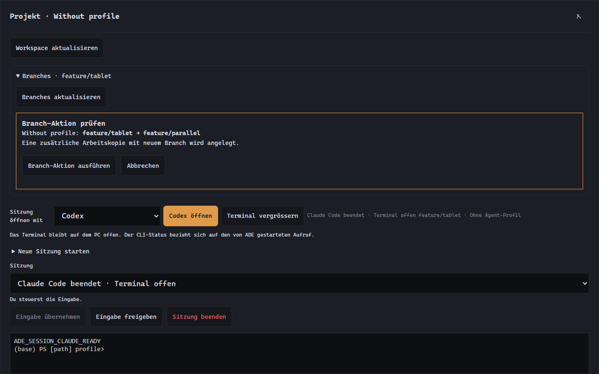

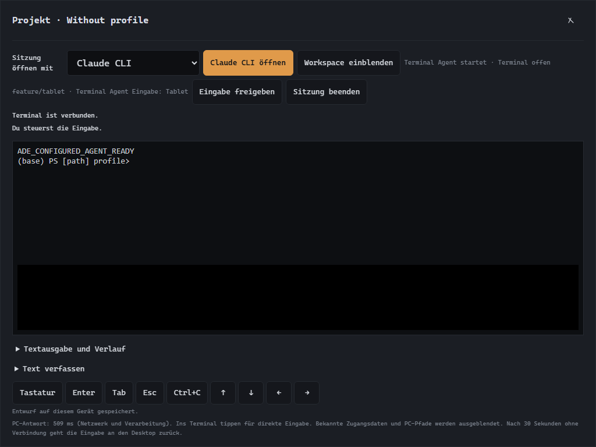

Diese beiden Aufnahmen stammen aus dem aktuellen isolierten Projekt-Test;
[Aufnahmedaten](media/user-guide/capture-projects.json).

Dieser Projekteinstieg ist für native Windows-Checkouts belegt. Für einen
Assistenten in einem WSL-Home den Agenten-Einstieg verwenden; WSL-Projekte haben
weiterhin ihren eigenen Desktop-/Backend-Ablauf.

## 6. Terminal und Tastatur bedienen


Zum Schreiben ins Terminal tippen oder **Tastatur** drücken. Falls der PC die
Sitzung steuert, zuerst **Eingabe übernehmen** wählen. **Du steuerst die Eingabe**
bestätigt, dass Tasteneingaben vom Tablet angenommen werden.

Der Sitzungsstatus unterscheidet beispielsweise **Claude Code läuft · Terminal
offen** und **Claude Code beendet · Terminal offen**. Im zweiten Fall ist Claude
beendet; Eingaben gehen an die Shell. Die Auswahl **Sitzung öffnen mit** bestimmt
den nächsten Start und ändert die laufende Sitzung nicht. **CLI-Status unbekannt**
bedeutet, dass ADE den Start/Abschluss nicht zuverlässig bestätigen kann.
Manuell in der Shell gestartete Programme werden dabei nicht neu erkannt.
Die vorhandenen Bilder zeigen noch den vorherigen Textstand; der abschliessende
Guide-Task aktualisiert die Aufnahmen zusammen mit dem neuen Projektablauf.

Wenn die Bildschirmtastatur Platz beansprucht, klappt ADE die zusätzlichen
Bedienelemente ein. Über **Bedienung** lassen sie sich wieder öffnen. Enter, Tab,
Esc, Ctrl+C und Pfeiltasten bleiben in der Tastenleiste erreichbar.


**Text verfassen** eignet sich für längere Texte oder Einfügen aus der
Zwischenablage. **Text und Enter senden** überträgt den Inhalt ausdrücklich.
Ein ungesendeter Terminalentwurf bleibt auf diesem gekoppelten Gerät über
Seitenneuladen erhalten. Er wird nicht automatisch abgeschickt.

**Textausgabe und Verlauf** zeigt einen begrenzten Textverlauf. Die Liveanzeige
unterstützt Farben und Cursor. Nicht jede Desktop-Terminalfunktion ist enthalten,
beispielsweise keine Dateiübertragung oder vollständiges Mausreporting.

**Workspace einblenden** bringt Dateien und andere Werkzeuge zurück.
**Eingabe freigeben** gibt die Steuerung an den Desktop zurück. Nach Verbindungsverlust
läuft die Eingabefreigabe ohne Lebenszeichen nach 30 Sekunden aus.

## 7. Hermes und OpenClaw ohne Projekt

Das Profil muss am PC bereits korrekt eingerichtet sein: eigener Arbeitsordner,
native oder WSL-Umgebung und der funktionierende TUI-Startbefehl. Ein persönlicher
Wrapper gehört zum **gespeicherten Agent-Profil**; die allgemeine Auswahl „Hermes“
ist kein Ersatz für dessen eigene Profilparameter.

In **Overview** beim gewünschten Agenten **Terminal öffnen** wählen. ADE öffnet
das gespeicherte Profil im eigenen Workspace. Ein Repository ist dafür nicht nötig.


Für die zweite Ansicht **Web-Dashboard** wählen. Der Link öffnet die am PC
hinterlegte private Dashboard-Adresse in einem eigenen Browser-Tab. Das Dashboard
muss separat erreichbar und gegebenenfalls separat angemeldet sein. ADE koppeln
meldet dich nicht automatisch bei Hermes oder OpenClaw an.

Dasselbe Prinzip gilt für **Sentinel/OpenClaw**: gespeichertes Profil für die TUI,
konfigurierte Dashboard-Adresse für die Weboberfläche. Verlauf und Wiederaufnahme
von Unterhaltungen richten sich nach dem jeweiligen Assistenten; ADE garantiert
keine gemeinsame Gesprächssitzung zwischen TUI und Dashboard.

## 8. Dateien behalten und Änderungen sichern

**Abo-Nutzung** am Terminal zeigt für native Codex-Sitzungen die gemeldeten
Restprozente und Reset-Zeitpunkte. Die Anzeige nennt ihren Messzeitpunkt;
Aktualisierungen werden für eine Minute zusammengefasst. Bei Claude/Grok führt
der angezeigte Befehl `/usage` zur Nutzung in der bereiten Anbieter-CLI. Diese
Kontingentwerte werden noch nicht automatisch in ADE übertragen. API-Verbrauch
und das Kontextfenster sind getrennt vom Abo-Kontingent.

Im aktuellen Code ergänzt **Sitzungsverbrauch** diese Anzeige für neue native
Windows-Codex-/Claude-/Grok-Starts. Sie zeigt gemeldeten Input/Output, darin
enthaltenen Cache/Reasoning und verfügbare Kosten mit ihrer jeweiligen Quelle.
Fehlende Felder bleiben unbekannt; API-Schätzungen sind keine Abo-Rechnung.
Bei geöffnetem Bereich wird alle zehn Sekunden aktualisiert. Der Ausbau ist im
am 15. September aktivierten persönlichen Programm verfügbar; die vollständige
Folgeabnahme und weiteren Ausbaustufen bleiben im Handoff als offen geführt.
Fortgesetzte ältere Gespräche, Forks, Unteragenten und andere Backends sind noch
nicht vollständig erfasst; eine unvollständige Anzeige ist keine Gesamtrechnung.

Nach einem Diktat zeigt derselbe Bereich **ElevenLabs · Diktat** mit den gemessenen
Audiosekunden. „Antwort erhalten“ bestätigt ein Ergebnis; „Abschluss ausstehend“
oder „Antwort unbestätigt“ kann ebenfalls Kosten verursacht haben. „Vor Versand
beendet“ bedeutet, dass ADE den Anbieter noch nicht aufgerufen hat. Credits und
Kosten pro Auftrag bleiben ohne eindeutige Anbieterquelle unbekannt. Diktate werden
der beim Aufnahmestart gewählten Sitzung zugeordnet. Stimmtests erfassen separat
Zeichen und ihren Projekt-/Profilbezug; eine gemeinsame Monatsansicht folgt noch.

Im Git-Bereich zeigt **Nächster Git-Schritt** die passende Reihenfolge; Quelle
und Ziel stehen vor einem Merge sichtbar da. Beim neuen Branch zeigt ADE den
gewählten Basis-Commit und meldet ungültige oder vorhandene Namen. Uncommittete
Dateien müssen zuerst gesichert werden, wenn ein separater Branch sie enthalten soll.

Im mobilen Terminal öffnet **Verlauf** die gespeicherte Textausgabe. Ebenso gehen
Hochscrollen mit dem Mausrad, nach unten wischen oder **Umschalt+Bild↑**.
Während du liest, bleibt diese Ansicht stehen, auch wenn neue Ausgabe eintrifft.
**Zur Live-Ausgabe** oder **Escape** schliesst sie; beim erneuten Öffnen ist sie
aktuell. Der Verlauf ist begrenzt (1.000 Scrollback-Zeilen, maximal 65.536 Zeichen
in der Textansicht). Von einer Terminalanwendung überschriebene Bildschirmbilder
sind kein gespeicherter Chatverlauf.

Für den neuen Projekteinstieg: **Projekte → Workspace öffnen → Git**. Zuerst die
laufende Terminal-Sitzung beenden, damit kein Assistent gleichzeitig Dateien ändert.
Der Git-Bereich zeigt den tatsächlichen Branch und HEAD sowie geänderte Dateien.

1. Bei einer Datei **Diff** öffnen und die Änderung prüfen.
2. Gewünschte Dateien ankreuzen, eine Commit-Nachricht schreiben und **Commit
   prüfen** wählen. Die Vorschau zeigt genau diese Auswahl.
3. **Git-Aktion ausführen** erstellt den Commit. Andere schon gestagte Dateien
   werden nicht mitcommittet. Bei einer alten Vorschau zuerst aktualisieren.

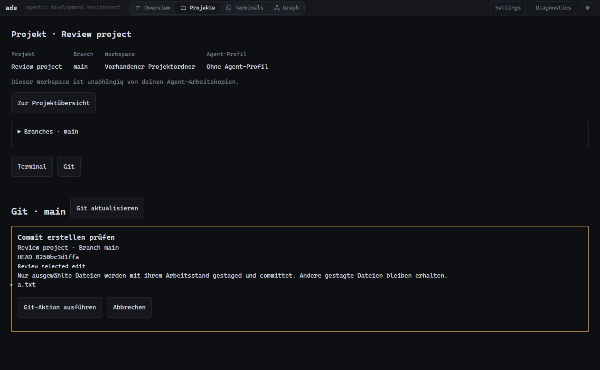

Zum Zusammenführen **Branches zusammenführen und Remote-Stand** öffnen, den
Quellbranch wählen und **Merge prüfen** verwenden. Der Merge bleibt zur Prüfung
offen. Bei Konflikten **Datei öffnen**, den Inhalt zusammenführen, die Markierungen
entfernen und **Datei speichern**. Danach die Konfliktdatei auswählen, **Als
aufgelöst prüfen** und abschliessend **Merge abschliessen prüfen**. **Merge
abbrechen prüfen** zeigt vorher an, dass die aktuelle Auflösung verworfen wird.
Grosse, geschützte oder verknüpfte Dateien müssen über die lokale CLI geprüft werden.

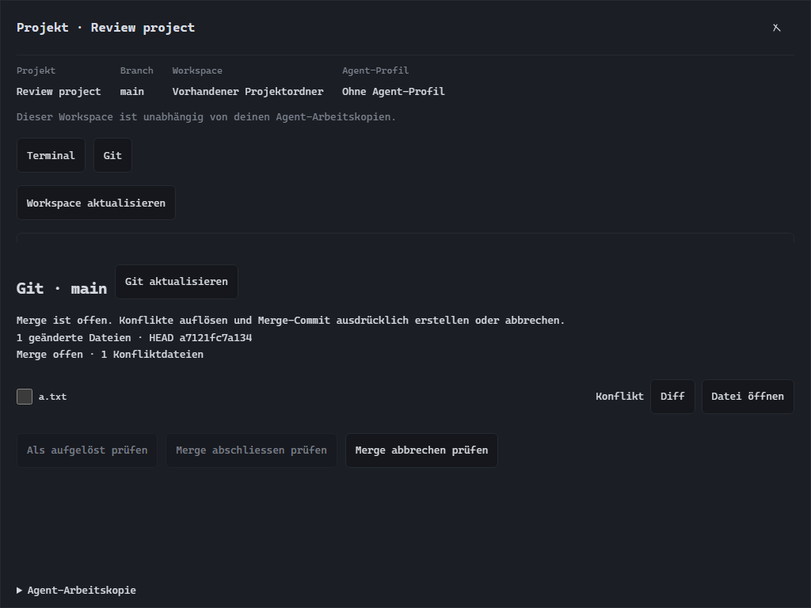

**Fetch prüfen** aktualisiert den gespeicherten Remote-Stand. Anschliessend den
Pull-Branch wählen und **Fast-forward prüfen**: das übernimmt nur einen direkt
fortsetzbaren Stand. Bei auseinanderlaufenden Branches ist ein bewusster Merge
nötig. Fetch veröffentlicht nichts.

Zum Veröffentlichen **Push und Pull Request** aufklappen:

1. Den Veröffentlichungs-Remote wählen und **Remote-Stand prüfen**. Ziel und
   lokaler/entfernter Commit werden angezeigt.
2. **Push prüfen** zeigt Branch, Commit und betroffene Dateien. **Push ausführen**
   überträgt diesen Stand. Bei auseinanderlaufenden Branches zuerst Fetch/Merge.
3. Für GitHub **GitHub Pull Request vorbereiten** öffnen. Zielbranch, Titel und
   Beschreibung ausfüllen; **Als Entwurf erstellen** ist vorausgewählt.
4. **PR prüfen**, Inhalt prüfen und **PR erstellen**. **PR öffnen** führt zum
   bestätigten Pull Request. Ein bereits vorhandener passender PR wird verwendet.

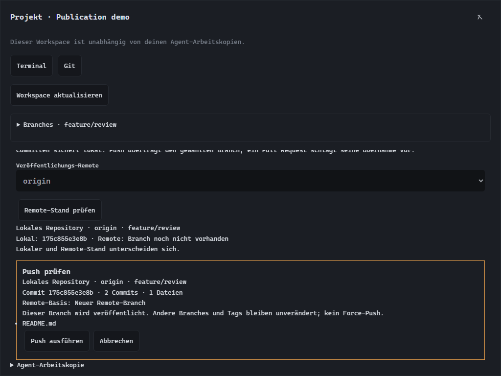

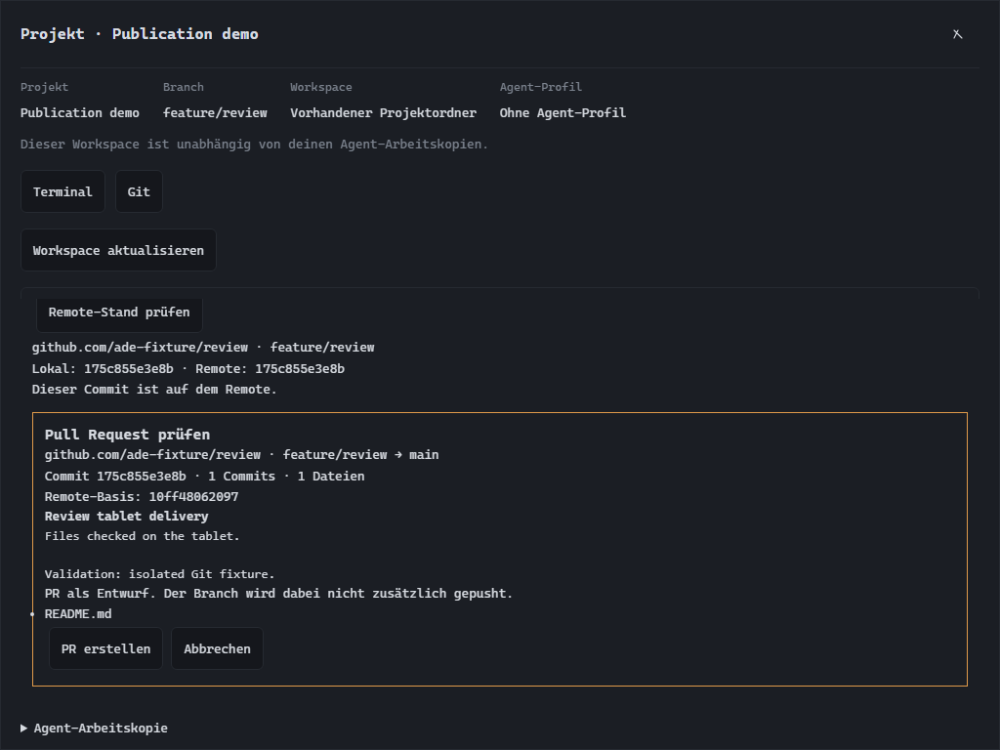

Für PRs muss GitHub CLI (`gh`) am PC installiert und bei GitHub angemeldet sein;
Installation/Anmeldung erfolgt ausserhalb dieses Dialogs. Der ausgewählte Remote
muss zu diesem GitHub-Repository führen. Der Branch muss vorher ausdrücklich
gepusht sein. Das entspricht der dokumentierten Wirkung des expliziten
[GitHub-CLI-Parameters `--head`](https://cli.github.com/manual/gh_pr_create).
Ein abgelehnter Push wird nicht mit Force wiederholt; siehe die
[Git-Dokumentation zum Push-Verhalten](https://git-scm.com/docs/git-push).

Am PC zusätzlich **Projekt-Branches pushen und GitHub-PRs erstellen** freigeben.
Nach einer verlorenen Antwort **Veröffentlichung erneut prüfen** verwenden.
**Remote-Stand prüfen** zeigt unabhängig davon den aktuellen Commit und offene
PRs. Eine Bestätigung nennt den damals übertragenen Commit; spätere Änderungen
werden erst durch erneutes Prüfen sichtbar.

Auf dem Tablet müssen **Projekt-Branches und lokale Git-Aktionen ausführen** und
zum Bearbeiten **Kleine Workspace-Textdateien bearbeiten** am PC freigegeben sein.
Nach einer verlorenen Antwort **Git-Aktion erneut prüfen** beziehungsweise
**Dateispeicherung erneut prüfen** wählen. ADE prüft denselben Vorgang auch nach
einem Neuladen. Ungespeicherter Editor-Text ist seitenlokal: vor einem Wechsel
speichern oder kopieren. Das Schliessen eines Editors verwirft diesen Entwurf.

**Dateien sind bereits auf dem PC gespeichert.** Ein Projekt, das du unter deinem
gewünschten Stammordner begonnen hast, muss zum Behalten nicht erst verschoben werden.
Der unabhängige Projekteinstieg verwendet den ausdrücklich gewählten Checkout.
Für Agent/Projekt-Paare und verwaltete Aufgaben verwendet ADE dagegen eigene Git-Arbeitskopien
(*Worktrees*) mit eigenem Branch. Neue Änderungen können dort liegen, während der
ursprüngliche Projektordner noch den älteren Stand zeigt.


*Nach einem Sitzungswechsel bei Bedarf **Workspace aktualisieren** drücken:
der kurze Arbeitsstatus in der Dateiansicht kann noch den vorherigen Stand zeigen.*

Zum Sichern und Weitergeben:

1. Im aktiven Workspace Dateien sowie **Git-Änderungen** prüfen. Am Desktop
   zeigt der Repository-/Sitzungsbereich den konkreten Branch und Arbeitsort.
2. Änderungen testen und in diesem Branch sichern. In einer interaktiven Sitzung
   kannst du den CLI-Assistenten ausdrücklich um einen geprüften Commit bitten.
3. Den Branch bewusst in deinen gewünschten Hauptstand übernehmen oder über
   deinen Git-/PR-Ablauf veröffentlichen. ADE erledigt das beim Schliessen nicht automatisch.
4. Für eine Sicherung ausserhalb des PCs zusätzlich einen passenden Remote-/Backup-Ablauf nutzen.

**Git-Abgleich** zum Abrufen und Fast-forward-Aktualisieren ist kein allgemeiner
„Meine Änderungen nach main übernehmen“-Knopf. Die geprüfte Integration verwalteter
Runs ist wiederum ein eigener Ablauf. Während solcher verwalteten Aufgaben besitzt
ADE die Git-Metadaten; deren Agents sollen nicht selbst committen oder pushen.

Eine laufende ADE-Arbeitskopie nicht per Explorer verschieben: Git und ADE kennen
ihren bisherigen Ort. Ein späterer Umzug braucht einen bewussten Repository-/Git-
Migrationsablauf. Ein Workspace-Bundle überträgt ADE-Konfiguration nach seinen
[Exportgrenzen](WORKSPACE_BUNDLES.md), es ersetzt kein vollständiges Projektbackup.

Der kleine Mobile-Dateieditor bearbeitet vorhandene UTF-8-Dateien bis 24 KiB.
Während eine Sitzung oder verwaltete Aufgabe diesen Workspace verwendet, kann das
Speichern gesperrt sein. Datei- und Profilentwürfe sind derzeit nur im Seitenspeicher:
vor Neuladen sichern. Das unterscheidet sie von Terminal-/Auftragsentwürfen.

## 9. Aufgaben und Runs

Wenn du nicht selbst im Terminal arbeiten möchtest, öffne **Work → Neue Aufgabe**.
Wähle Projekt und Agent und beschreibe ein abgegrenztes Ergebnis samt Prüfschritten.
Eine solche Aufgabe läuft über ADEs verwalteten Ablauf.


**Neuer Run** ist für koordinierte Arbeit mit mehreren Agents gedacht. Projekt,
Team, Grenzen und Auftrag festlegen; vorbereiten und ausdrücklich starten.
**Work** zeigt Fortschritt und Status, **Graph** die Beteiligten und Beziehungen.
Die Task-Slots gelten über alle Projekte hinweg.

Beginne mit einer kleinen Einzelaufgabe, bevor du ein Team zusammenstellst.
CLI-Verfügbarkeit allein ist kein Nachweis, dass deren verwalteter Adapter jeden
Run-Typ unterstützt. Den gemessenen Stand nennt [STATUS.md](STATUS.md).
Integrationsfreigabe und verifiziertes Publishing bleiben Desktop-Abläufe. Ein gestarteter Run veröffentlicht nicht automatisch.

### Ergebnis und Bild auf dem Tablet abrufen

1. Unter **Work** den betreffenden Run öffnen, oder in **Graph** den Run auswählen
   und auf seinen Agent-Knoten tippen.
2. In den Run-Details zu **Aktivität & Ergebnis** gehen. **Aktivität** zeigt den
   bestätigten Prozesszustand und die zuletzt empfangenen CLI-Schritte.
3. **Ergebnis** zeigt die gespeicherte Abschlussantwort. Bei älteren Runs kann sie
   fehlen; das wird ausdrücklich angezeigt. „Completed“/Exit 0 bedeutet zunächst,
   dass der Prozess erfolgreich beendet wurde — die Antwort und Dateien prüfen.
4. **Dateien → Bild ansehen: …** öffnet eine Vorschau. **Herunterladen: …** speichert
   das Bild über Chrome auf dem Tablet. Für Tabellen oder Markdown zuerst
   **Download vorbereiten: …**, dann **Herunterladen: …** wählen.


Diese Screenshots stammen aus einem isolierten Test mit deterministischer CLI und
einer echten Terminal-Sitzung; das farbige Testbild ist kein Modell-Qualitätsbeleg.
**Direkter Weg:** In **Graph → Dateien dieses Runs** findest du die Dateien aller
Aufgaben dieses Runs. Alternativ **Projekte → Workspace öffnen → Ergebnisse**:
Der jüngste Run ist vorausgewählt; mit der Run-Auswahl kannst du frühere öffnen.

| Anzeige | Bedeutung |
|---|---|
| Neu / Verändert / Gelöscht | Vergleich zwischen Aufgabenstart und Prozessende |
| Vom Agenten gemeldet | Dateiangabe aus der Antwort ohne unabhängigen Vergleich |
| Zuordnung unbekannt | Für diese frühere Aufgabe fehlt der Ausgangsstand |
| Seit Run-Ende erneut verändert | Der Download enthält den neueren, aktuellen Stand |

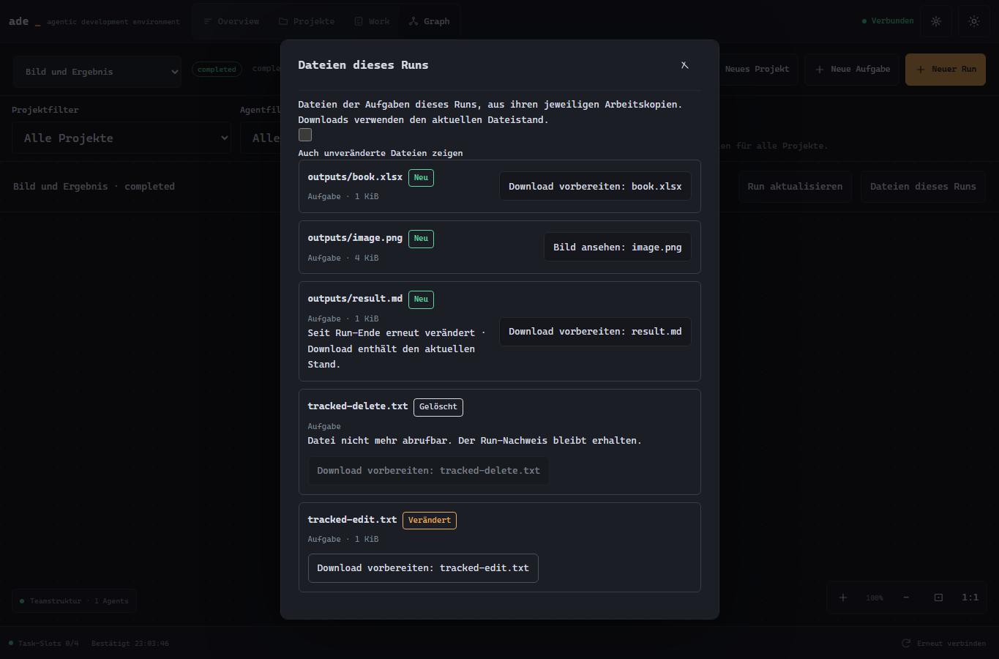

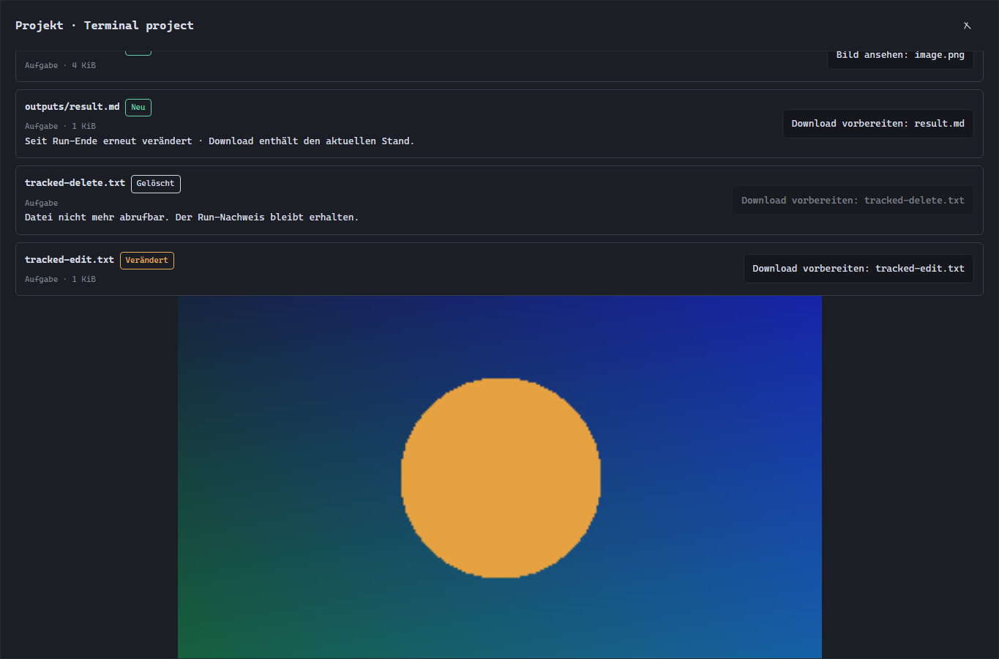

Bei Bildern **Bild ansehen**, danach **Herunterladen** wählen. Bei Excel, PDF oder
anderen Dateien **Download vorbereiten**, danach **Herunterladen**. Anschliessend
in Chrome unter **Downloads** öffnen und eine passende Tablet-App wählen.
ADE zeigt PNG/JPEG/WebP als Vorschau; Tabellen und andere Dokumente öffnest du
nach dem Download. Die Grenze beträgt 16 MiB pro Datei; begrenzte Listen werden
gekennzeichnet. Textdownloads blenden bekannte Zugangsdaten und PC-Pfade aus.

Die Dateien bleiben in der ursprünglichen Aufgaben-Arbeitskopie. **Ergebnisse**
kopiert sie nicht automatisch in den aktuell gewählten Branch. Gelöschte Dateien
bleiben als Nachweis sichtbar und lassen sich nicht herunterladen. Bei später
entferntem Workspace zeigt ADE den fehlenden Zugriff; es gibt noch kein separates
dauerhaftes Dateiarchiv. Während eine Datei geschrieben wird, später **Dateien
aktualisieren** wählen. Bei älteren Runs bedeutet „Zuordnung unbekannt“ nicht,
dass die vorhandenen Dateien verloren sind: Vorschau und Download bleiben möglich.

Falls die Lesefreigabe fehlt: am PC unter **Settings → Geräte** für das gekoppelte
Tablet **Workspace-Dateien und Git-Diffs lesen** aktivieren. Die Vorschau benötigt
eine Verbindung zum PC. Bei einem alten Browserstand ADE in Chrome neu laden.

## 10. Pausieren, weiterarbeiten und aktualisieren

| Aktion | Wirkung |
|---|---|
| Workspace-Dialog am Tablet schliessen | Terminal läuft auf dem PC weiter |
| Browser neu laden | ADE verbindet sich wieder; bestehende PC-Sitzung kann erneut geöffnet werden |
| Eingabe freigeben | Prozess läuft weiter, Desktop übernimmt die Eingabe |
| Sitzung beenden + bestätigen | Der ausgewählte Terminalprozess wird beendet |
| ADE-Fenster schliessen, mobiler Zugriff aktiv | ADE bleibt im Infobereich des PCs aktiv |
| ADE im Tray vollständig beenden / PC neu starten | Laufende Terminalprozesse enden; Dateien bleiben bestehen |

Zum Weiterarbeiten dasselbe Projekt bzw. denselben Agenten öffnen und eine
bestehende Sitzung verwenden. Nach einem vollständigen ADE-Neustart muss die CLI
neu gestartet werden. Ob ein früheres Gespräch fortgesetzt werden kann, hängt
von deren eigener Resume-/Verlaufsfunktion ab.

Für einen **Windows-Quellcode-Update** erst aktive Arbeit abschliessen, ADE über
das Tray vollständig beenden und im ADE-Repository ausführen:

```powershell
git pull --ff-only
pnpm install --frozen-lockfile
pnpm build
pnpm start
```

Danach Chrome neu laden. Lokale Änderungen bei einem Git-Konflikt zuerst erhalten
und prüfen. Ein Build allein ersetzt die Mobile-Dateien eines bereits laufenden
Hosts nicht. Die Gerätekopplung bleibt bei normalem Update mit demselben Profil
erhalten. Ein automatischer Updater ist noch nicht vorhanden.

**Das Tablet zeigt trotz Build noch den alten Stand:** Bei aktiviertem mobilen
Zugriff beendet das X am PC nur das Fenster. Auch ein erneutes `pnpm start`
ersetzt die laufende Instanz nicht. Im Infobereich (gegebenenfalls unter dem
Pfeil für ausgeblendete Symbole) ADE → **ADE und mobilen Zugriff beenden**
wählen, dann `pnpm start` und dieselbe Tablet-Seite neu laden. Wenn bereits
`pnpm build` erfolgreich lief, ist kein weiterer Build nötig. Browserdaten und
Gerätekopplung dafür nicht löschen.

## 11. Wenn etwas nicht funktioniert

| Beobachtung | Nächster sinnvoller Schritt |
|---|---|
| Offline / Verbindung wird hergestellt | PC wach und ADE aktiv? Beide Geräte in Tailscale verbunden? Am PC **Verbindung prüfen**, am Tablet **Erneut verbinden**. Bei festhängendem Android-VPN Tailscale neu verbinden; danach Chrome neu laden. |
| Tailscale verbunden, Chrome erreicht ADE trotzdem nicht | Die Adresse aus ADE verwenden. Chrome darf in Tailscale nicht ausgeschlossen sein. Gerätezeit automatisch synchronisieren. Bei Namens-/Zertifikatsfehlern die konkrete Meldung und PC-HTTPS-Prüfung untersuchen. |
| Projekte oder neuer Einstieg fehlen | Mobile-Seite nach einem vollständigen ADE-Update neu laden; prüfen, ob am PC wirklich der neue Host läuft. |
| Neues Projekt meldet fehlende Einrichtung | Am PC Stammordner speichern; Projektverwaltung und Terminalrecht für genau dieses gekoppelte Gerät freigeben. |
| Workspace lässt sich nicht vorbereiten | Leserecht und bei neuer Arbeitskopie Projektverwaltungsrecht prüfen; angezeigten Backend-/Git-Fehler am PC lösen. |
| Keine Tastatur | Zuerst **Eingabe übernehmen**, dann ins Terminal tippen oder **Tastatur** drücken. Eine beendete Sitzung zuerst neu öffnen. |
| Tippen wirkt verzögert | Angezeigte PC-Antwortzeit notieren, lokalen Desktop vergleichen, WLAN/Tailscale-Verbindung prüfen. Dieser Wert enthält Netzwerk und PC-Verarbeitung; er ist keine reine Funklatenz. |
| Eingabe möglicherweise angekommen | **Eingabestatus prüfen** und Ausgabe lesen; denselben Befehl nicht blind erneut senden. |
| Dateien lassen sich nicht speichern | Aktive Sitzung/Lease und Dateigrösse prüfen; bei Konflikt den aktuellen Inhalt mit dem Entwurf zusammenführen. |
| CLI fehlt / Anmeldung schlägt fehl | Installation und Anmeldung am PC in der richtigen Windows-/WSL-Umgebung prüfen. |
| Dashboard verlangt Anmeldung | Separate Anmeldung im Dashboard durchführen; ADE-Terminal und Dashboard bleiben eigenständige Zugänge. |
| Gerät verloren oder nicht mehr verwendet | Am PC unter **Verbundene Geräte** Zugriff widerrufen. Lokales Trennen im Browser ersetzt den Widerruf nicht. |

Tailscale dokumentiert, dass ausgeschlossene Android-Apps sowohl Routing als auch
DNS an Tailscale vorbeiführen. [Android-App-Ausnahmen](https://tailscale.com/docs/features/client/android-app-split-tunneling).
ADE nutzt private Freigaben im Tailnet; [Tailscale Serve](https://tailscale.com/docs/features/tailscale-serve)
beschreibt dieses Zugriffsmodell. Für ADE keine öffentliche Portfreigabe einrichten.

Für eine Fehlermeldung helfen: ADE-Ansicht, gewähltes Projekt/Profil, Zeitpunkt,
Verbindungsstatus, ob der Desktop dieselbe Störung zeigt und ein Screenshot ohne
Zugangsdaten. Weitere Details: [Verbindung einrichten](goal8/MOBILE_CONNECT_GUIDE.md),
[Terminalfreigaben](REMOTE_TERMINAL_GUIDE.md), [Dokumentationsübersicht](README.md).

## Projekte und Agenten für ein Tablet auswählen

Am PC unter **Settings → Verbundene Geräte** beim Tablet
**Nur ausgewählte Projekte und Agenten** wählen. Die gewünschten Projekte und
Agenten ankreuzen oder **Alle derzeitigen auswählen** verwenden. Erst
**Verwaltungsrechte speichern** übernimmt die Auswahl; das Tablet verbindet
sich danach erneut. Eine leere Auswahl zeigt keine Projekte oder Agenten.
Neue Projekte und Agenten sind in diesem Modus erst nach einer weiteren Freigabe
erreichbar. **Alle, einschliesslich künftig hinzugefügter Projekte und Agenten**
gibt auch spätere Einträge frei. Die Auswahl und die Aktionsrechte gelten
gemeinsam: für Commit/Merge die Projekt-Git-Rechte, für Push/PR zusätzlich die
Veröffentlichungsrechte aktivieren. Ein freigegebenes Terminal arbeitet mit den
Rechten deines PC-Benutzers.

## Während eines Runs mitreden

Bei **Neue Aufgabe** oder **Neuer Run** kannst du **Rückfragen erlauben** aktivieren,
wenn die ausgewählten Agenten native Codex-Agenten sind. Im Desktop-Graph öffnet
**Rückfragen beantworten** die offenen Fragen im Bericht. Auf dem Tablet wählst
du den Run und beantwortest die Frage im Rückfragenbereich. Erst **Antwort senden**
übermittelt deine Auswahl. ADE wartet auf Codex' Empfangsbestätigung.

**Live zuschauen** am PC beziehungsweise **Aktivität** am Tablet zeigt, welche
Werkzeuge und Dateien der Agent gemeldet hat. Im interaktiven Terminal kannst
du zusätzlich direkt mit der gewählten CLI arbeiten. Bei einer blockierenden
Rückfrage pausiert das Aufgaben-Zeitlimit. Eine Eingabe bleibt bei Drehung und
kurzem Offline-Zustand im geöffneten Fenster; ein Browser-Neuladen verwirft den
Formularentwurf. Nach einem ADE-/Agent-Neustart sind alte Fragen abgelaufen.

## Ergebnisse später wiederfinden

Unter **Projekte → Workspace öffnen → Ergebnisse** kannst du mit **Ältere Runs**
und **Neuere Runs** durch die gespeicherte Run-Historie blättern. **Gesichert am
Aufgabenende** bezeichnet eine Ergebnisdatei, deren damalige Bytes ADE aufbewahrt.
Sie bleibt auch nach späteren Änderungen oder Löschen in der Arbeitskopie
abrufbar. Weitere Dateien zeigen den aktuellen Workspace-Stand. Alte Runs vor
dieser Erweiterung haben noch keine nachträglich erfundenen Sicherungen.

Pro Datei gilt 16 MiB, pro Aufgabe werden bis zu 100 geänderte Dateien gesichert;
der Ergebnisspeicher ist auf 2 GiB begrenzt. Eine unvollständige Sicherung wird
angezeigt. Die Seitennavigation zeigt die im ADE-Journal behaltenen Runs;
bereits in JSON ausgelagerte Langzeitarchive bleiben Operator-Dateien.

Abgeschlossene, fehlgeschlagene und abgebrochene Runs kannst du auf Mobile in
**Work → Run auswählen → Run löschen** aus dem Verlauf entfernen. Bestätige
die Rückfrage; Projektdateien und Workspaces bleiben erhalten. Runs mit einem
Veröffentlichungsnachweis lassen sich nicht löschen. Das gekoppelte Gerät
benötigt vollständige Ressourcenfreigabe. Bei einer verlorenen Antwort bietet
**Diesen Auftrag erneut prüfen** dieselbe Löschbestätigung auch nach Neuladen an.

## Übernahme und Agent-Obergruppen

Unter **Repository synchronisieren** (Desktop) beziehungsweise
**Verwalten → Git-Abgleich** (Mobile) führt **Änderungen übernehmen…** durch
Dateiauswahl, separate Arbeitskopie, Projektprüfungen und ausdrückliche Übernahme.
Die einzelnen Schritte und die Wiederaufnahme gespeicherter Berichte stehen in
[WORKSPACE_INTEGRATION.md](WORKSPACE_INTEGRATION.md).

Kategorien erhalten optional eine **Obergruppe**, zum Beispiel **Agent-Systeme**.
Auf Desktop steht das Feld in den Kategorieeinstellungen, auf Mobile unter
**Verwalten → Agents → Obergruppen**. Leeres Feld entfernt die Obergruppe.
Mehrere Kategorien mit gleichem Gruppennamen erscheinen zusammen; Agenten und
ihre Projektzuordnungen bleiben erhalten. Die Suche in der Terminal-Navigation
findet auch Agenten in eingeklappten Gruppen. Der Auf-/Zuklapp-Zustand wird je
Gerät gespeichert.


## Persönliche Tasks und Notes

Unter **Organisation** findest du **Tasks** für Aufgaben und **Notes** für freie
Notizen. Die Navigation kannst du mit der Schaltfläche links einklappen; der
aktuelle Bereich bleibt am Schalter sichtbar. Pfeiltasten wechseln die Seiten,
Escape klappt die Navigation zu.

**Neue Aufgabe** oder **Neue Notiz** beginnt ohne Projekt und ohne Agent. Schreibe
oder diktiere deinen Text und ergänze bei Bedarf Fotos. Notizen haben zusätzlich
eine Zeichenfläche mit Stift, Radierer, Rückgängig/Wiederholen und Fotohintergrund.
„Nur Stift“ ignoriert Fingerberührungen. Auf der Zeichenfläche bewegen Pfeiltasten
den Zeichenpunkt, Umschalt plus Pfeiltaste zeichnet, Leertaste setzt einen Punkt.

Tasks bieten Checkliste, Fälligkeit und Erinnerung. „Heute“ enthält auch überfällige
Aufgaben; „Später“ zeigt offene Aufgaben ohne Fälligkeit. „Erinnerungen“ zeigt fällige,
noch nicht bestätigte Hinweise. Der PC muss für Desktop-Erinnerungen mit ADE laufen.
Benachrichtigungen im Hintergrund hängen von den Systemeinstellungen ab. Auf dem
Tablet siehst du Erinnerungen beim Öffnen; es gibt keine zugesicherte Push-Zustellung
bei geschlossener App. Eine Erinnerung startet keine Agentenarbeit.

**An Agenten übergeben** zeigt vor dem Start Projekt, Agent und Auftragstext. Titel,
Text und Checkliste werden übergeben; Fotos/Skizzen bleiben an der persönlichen
Aufgabe. Nach Bestätigung führt „Auftrag öffnen“ zum Run. Bei verlorener Antwort
„Übergabe erneut prüfen“ verwenden: Der gespeicherte Vorgang wird wieder aufgenommen.
Der Erledigt-Status deiner Aufgabe bleibt unabhängig vom Agentenauftrag.

„Aufgabe daraus erstellen“ übernimmt eine Notiz als neue Aufgabe. Markierst du
vorher Text, wird dieser Ausschnitt übernommen. Das Original bleibt erhalten.
**Text als Markdown**, **Skizze als PNG** und **Als PDF speichern** laden Dateien
herunter; die Notiz bleibt weiterhin bearbeitbar. PDF enthält gerasterten Text,
Zeichnung und Fotos. Markdown exportiert den Text und die Checkliste.

Änderungen werden zuerst auf diesem Gerät gespeichert. „Mit dem PC abgeglichen“
steht erst nach bestätigter Verbindung da. Offline kannst du Text und Zeichnungen
weiter erfassen; Diktat benötigt den PC und den eingerichteten ElevenLabs-Zugang.
Gleichzeitige Änderungen ergeben eine Konfliktkopie mit beiden Fassungen. Bei einem
Speicherfehler bleibt der Entwurf in der geöffneten App: erneut speichern oder
exportieren, bevor du die App schliesst. Privates Browsen oder das Löschen von
Browserdaten kann lokale, noch nicht abgeglichene Inhalte entfernen.

Bestehende Tablets benötigen am PC unter **Settings → Verbundene Geräte** die
Freigaben **Persönliche Aufgaben und Notizen lesen/bearbeiten**. Für Diktat kommt
die Diktatfreigabe hinzu. Eine neue Kopplung ist dafür nicht nötig. „Dieses Gerät
lokal trennen“ entfernt auch die auf diesem Gerät gespeicherten Tasks-/Notes-Daten;
auf dem PC bestätigte Inhalte bleiben dort erhalten.

Aktueller Ausbau- und Prüfstand: [Tasks und Notes](TASKS_NOTES.md).
